# 中华的崩溃与扩大：魏晋南北朝

**［日］川本芳昭 著　余晓潮 译　广西师范大学出版社（理想国）2014**

> 本文本由 QQ阅读公开试读页面抓取整理，仅供个人学习研究，版权归原作者及出版方所有。
> 收录范围：推荐序、中文版自序、前言、第一章（全）、第二章（全）、第三章（前半）。
> 第18–58阅读单元为付费章节，未收录。

---

## 推荐序

日本历史学家的系列著作《中国的历史》，将以中文出版，提供给中国的历史爱好者，其中有九州大学教授川本芳昭先生的著作《中华的崩溃与扩大》。

川本先生的专业为东亚古代史。他以中国为中心，对东亚的政治史、民族问题与国际关系等进行过长期的研究。这部《中华的崩溃与扩大》深入浅出，文笔兼平实与活泼之致，颇具可读性；其对魏晋南北朝史的叙述和解说，来自川本先生长期研究的个人心得，也能反映日本学界对此期历史的许多看法。被译为中文的日本中国史论著，越来越多了。《中国的历史》这个系列，包括川本先生的这部著作，应能推动中国读者进一步了解日本学界的相关成果。

因地缘临近的关系和悠久的文化交流，日本对中国史的了解较早且相当深入。其传统学风本来就具有细密扎实的特点，中国乾嘉考据学的影响，强化了其浓厚的实证精神。明治以来，欧洲史学的学风、方法和论点，又催生了现代的新鲜眼光。对中国语言的熟悉，更是其超过西方学者的得天独厚优势。有的中国学者这样评价：在中国之外，日本学者的中国史研究成绩，在总体上超过欧美。

在宏观框架和具体史实的解释上，中日学者各有见仁见智之处。这一点自是读者所当注意且最有启迪的。例如，川本先生在本书的“前言”部分申说：“魏晋南北朝时期一般被称为‘贵族制’的时期。这固然是由于东汉末年的混乱中出现的身为贵族的文人知识分子既成为乡村社会的领导，又进入中央和地方政界的统治阶层，从而备受后人的关注。”所谓“贵族制”，乃是日本学者长久研讨的论题，涉及了其对魏晋南北朝的总体看法。文史专业的中国读者，对之当然不会陌生；而对非文史专业的读者，就未必都清楚了。

近代以来，在用新眼光审视中国史上，日本学者比中国学者先行一步。“京都学派”的创始人内藤湖南，把中国史分为上古、中世、近世三大段。所谓“上古”或“古代”，至东汉中期而止，被看成是中国文化的形成、发展和扩张期。经东汉中期到西晋的过渡，进入了六朝这个“中世”时代，其最大特点是“贵族制”：“六朝至唐中叶，是贵族政治最盛的时代。这个时期的贵族制度，并不是天子赐予人民领土，而是由地方有名望的家族长期自然相续，从这种关系中产生世家……君主是贵族的共有物。”（内藤湖南《概括的唐宋时代观》）唐宋之际，中国又向“近世”推进。这个“三段论”的模式，看上去与西欧史的古代、中世纪、现代三段论，有某种可比之处。“近世”的各种变化，是参照西欧“近世”而被阐述的。又，法国学者白乐日、谢和耐所勾勒的中国史分期，与之有类似之处。

“古代国家”、“六朝贵族”、“唐宋变革”等论题，此后被京都学派的学者们不断地充实、深化。在“贵族制”的长久讨论中，各种观点纷纷涌现，异彩纷呈。矢野主税、越智重明等学人，与京都学派不尽相同，对中古“贵族的自律性”的评估没那么大，对此期的君权和官僚身份，则有更多的强调。矢野认为，“贵族因国家权力的存在才得以成立”，“贵族就是寄生官僚”（《门阀社会成立史》）。越智主张，贵族阶层因国家权力才能得以成立，从而凸显了君主对于贵族阶级的优越性（《魏晋南朝之贵族制》）。

川本先生是越智的学生。其对“贵族制”的认知，构成了本书中相关人物、事件、制度的背景。例如本书第一章第一节，阐述了“公权力之私有化与‘公’之再建构趋势”；第四章的标题是“江南贵族社会”，其第一节的标题是“东晋的贵族社会”，都反映了这样一点。这是中国读者所当注意的。又如，第四章第三节的标题被译为“向贵族制的转变与宋齐军事政权”（原文是“貴族制の変容と宋·斉軍事政権”），所申说的实际是“该政权并非由贵族所建，而是由军人创立”，“军人政权可以说是宋朝以后各王朝的一大特征”，“贵族的式微因寒门、平民的抬头而日益彰显”。这就是在提示读者，由贵族制到军人政权，其间已发生了某种“转变”。按，此前越智已提出，自刘宋到梁武帝天监年间，由于皇帝改革，通过起用寒人阶层而加强了皇权，贵族便丧失了“自律性”。宫崎市定对此期政治变动的阐述，是“军阀帝王与贵族结合的政治”（《九品官人法的研究》序）。中国学者田余庆先生，则把刘裕集团视为“门阀政治的掘墓人”（《东晋门阀政治》）。相关论点的同异，不妨对照观看。

中国现代史学的萌发过程中，一代宗师也在不断涌现。除了各个专题、断代研究的巨大进步外，在历史分期方面，两千年传统史学家们闻所未闻的原始社会、母系氏族、父系氏族、奴隶社会、封建社会、资本主义社会等概念，被学人纳入视野，越来越多地使用了。其中郭沫若先生运用唯物史观、借助“五种生产方式”所建构的框架，最富理论性。日本学者西嶋定生称之为“一个划时代的功业”（《二十等爵制研究》序章）。在郭氏的最终看法中，夏商周是“奴隶社会”，战国进入“封建社会”；魏晋南北朝的时代特殊性之一，在于“豪强士族地主”。因种种原因，郭氏的分期之法进入了大学与中学教科书。很多非历史专业的人士和书刊，至今仍然习用着“战国以来的封建社会”的说法。

魏晋南北朝史的若干名家，在历史分期上主张“魏晋封建论”。何兹全先生在上世纪三四十年代提出，战国秦汉是“古代社会”，汉末三国进入封建社会，此期出现了如下变化：由城市交换经济到农村自然经济，由自由民、奴隶到部曲、客，由土地兼并到人口争夺，由民流到地著（《读史集》）。唐长孺先生说：“魏晋户口下降的原因虽有多方面，但根本的原因在于魏晋时期封建大土地所有制的发展，使大量户口沦为私家的佃客。”（《魏晋南北朝隋唐史三论》）王仲荦先生说：“魏晋南北朝时期，封建土地所有制的形态，是世家大地主占有了大量土地和不完全占有土地上的耕作者依附农民——部曲、佃客。”（《魏晋南北朝史》）

在相当一段时间中，因以唯物史观为本，中国学者更多聚焦于“所有制”的辨析之上。而日本学界对“贵族制”的讨论，通过各种事象辨析皇权、贵族、官僚之关系，相对更为细密，其分析方法，即便从现代政治学的角度看，也颇多可圈可点之处。当然，对士族门阀现象，中国学者仍有非常出色的研究，如唐长孺先生对士族升降沉浮等现象的讨论，如田余庆先生对“东晋门阀政治”的阐述。同时在“二战”之后，唯物史观深刻影响了日本史学，对经济关系大为重视了，发展出了把汉唐间的社会视为奴隶制、农奴制或亚细亚生产方式等等新看法；京都学派的“三段论”，也更多地从经济层面（如租佃制）和社会层面（如“共同体”）推进了。

“战国封建论”与战国秦汉的剧烈社会转型合拍。这时发生了一个剧烈转型，古人也作此观感。王夫之有“战国者，天地一大变革之会”之论，赵翼有“盖秦汉间为天地间一大变局”之说。“魏晋封建论”把汉晋之交处理为两大社会形态的转捩之点，自此之后，就一直“封建”下去了。在这里，以及在京都学派的“三段论”中，战国的那场历史巨变不够鲜明。“唐宋变革”的提法，令中国史的中后期波澜再起，以此来解说唐宋间的各种变化，研究者会感觉很“给力”。改革开放之后，国内学界对“唐宋变革”的关注大增，若干唐宋史学者乐于在不同程度上、以各种方式参用其说。在内藤的“三段论”中，“贵族制”与“唐宋变革”是相关的。“变革”的表现之一被认为是君主独裁，而六朝的“贵族制”，就反衬出了唐宋间的变化足以构成“变革”，是划时代的。但如认为六朝大体仍是皇权主导，贵族制只是一种政治现象，而非社会形态，那么它与宋代君主独裁的反差到底有多大，是否大到足以构成“变革”的程度，就应再行推敲了。

除了“贵族制”之外，民族问题，一向被看做魏晋南北朝的又一时代主题。东亚民族研究，是川本先生用力最勤的课题之一，有专著专论。本书也把此期确定为一个“汉民族与异民族、异文化之间的大对抗、大融合时期”，并揭举了这样的任务：“自汉帝国以后，经过与诸多异族和异文化之间的对立和融合，汉族文化和文明发展演变至今日。运用这种民族形成的视角对魏晋南北朝时期进行分析梳理之后，这个时期将会有什么样的真相浮出水面？”进而对十六国北朝的胡汉民族、胡汉政治集团和胡汉文化的冲突融合，对相关的政治发展，提供了系统的论述。（当然，南方少数族问题也未被忽略）

对此期胡汉关系的大趋势，作者使用了“中国化”一词。第七章第二节的一个论断，就是“孝文帝的各项改革实质上是北魏王朝的中国化”。“中国化”的用词，也被用于解释此期中国文化的域外影响，即对东亚各地区的外部辐射。这也是川本先生长期致力的论题之一。较早时候，中国学者在论述十六国北朝时，除了使用“汉化”一词之外，还有人使用过“封建化”的概念。这个“封建化”概念，其实是容易引起疑问的，因为对什么是封建制，有很不相同的定义。川本先生还进一步提出“华夷秩序的变貌”的问题：原属夷狄、从五胡中崛起的北朝发展为隋唐，成为中国的正统王朝，“这是一种逆转现象”，“原来非正统的王朝成为了正统，这里展现了一段非常耐人寻味的历史发展进程”。确实，此期北方少数族对中国史进程的影响，其最耐人寻味之处是什么？无疑值得深思。

内藤湖南的上古、中古和近世“三段论”，不妨说是一种“文化史观”。如内藤之所云：“我之所谓东洋史，就是中国文化发展的历史。”（《中国上古史》绪言）内藤认为，受中国文化浸润的异民族，又给了中国本土以反作用，使中国这个逐步衰颓的民族得以“返青”（《新支那论》）。进而，宫崎市定伸张“朴素主义”之说，意谓中华文明一经成熟，便走向纤细颓靡；而胡族入主带来的“朴素主义”，使中华得以克服了“文明主义”的颓靡（《东洋朴素主义的民族和文明主义的社会》）。这类论点因其背后的政治意向，即适应当时日本在东亚扩张的意向，在“二战”之后受到批判。中国学者的常见表述，是此期的所谓“五胡”经“汉化”而融入了中华民族大家庭，从而在经历了民族冲突之后，迎来了中华民族文化的新发展。

唐长孺先生在若干年前提出了“南朝化”理论。这个理论认为，进入唐朝之后，北朝在经济、文化、制度等方面的残留影响，就在不断地淡化，并向南朝所代表的方向转变；由此看来，十六国北朝只是中国史上的一段不必要的曲折。这一论点，突出了中国文化的连续性和周边少数族“汉化”的必然性。而数十年前陈寅恪先生论唐史，曾有“取塞外野蛮精悍之血，注入中原文化颓废之躯，旧染既除，新机重启，扩大恢张，遂能别创空前之世局”之说（《李唐氏族之推测后记》。其另一表述是“唐代以异族入主中原，以新兴之精神，强健活泼之血脉，注入于久远而陈腐之文化，故其结果灿烂辉煌”，吴宓转述）。如果这样的话，北朝就不完全是中国史上的一段不必要的曲折了。李唐皇室血统的考证，连带引发了陈氏的这一感想，但无更进一步的具体讨论。钱穆先生认为，魏晋南北朝是一个“文化病”的时代，而北朝受病较浅；北周继承了汉代儒学，用周礼改制，遂重开中国历史之光昌盛运（钱穆：《纵论南北朝隋唐的儒学》，《略论魏晋南北朝学术文化与当时门第之关系》）。钱穆既承认北朝的振兴政治之功，又将之归结为中华文化之功，而且把它具体化了，具体化到儒学、周礼之上了。田余庆先生又有“从宏观来看东晋南朝和十六国北朝全部历史运动的总体，其主流毕竟在北而不在南”的论断（《东晋门阀政治》）。对十六国北朝史的不同认识，在更大范围上说，还涉及了历次北方少数民族入主华夏的现象对中国史进程的影响这一重大问题。程树德、陈寅恪都曾对南北朝的制度源流关系提出专论。集权官僚政治制度的南北差异，是又一个非常有潜力的话题，并且可以在借鉴政治学方法，在政治结构、政治集团、政治文化多方面深入下去。近年李治安先生还以“南制─北制”视角观察元明时代，进而提出了“第二个南北朝”的论题（《两个南北朝与中古以来的历史发展线索》）。

“经济史观”所使用奴隶社会、封建社会、资本主义社会进化模式，来自西方史学；将其用于中国史，难免会引发另一些学者的“生硬”之感。基于“文化史观”的“三段论”，与西欧史的“三阶段”有神似处。而中国史发展的内在节奏与韵律，是否被淡化了呢？在内藤湖南观察欧洲思想史时，已看到了一个分裂、统一、再分裂、再统一的进程。日本学者讨论日本史的“近世”，比照西欧从文艺复兴向绝对王权的发展，以镰仓、室町时代为“近世”，由此进及中国史的“近世”，即以宋元明为“近世”。学界曾有“打破王朝体系”的尝试。内藤云：“从历史特别是从文化史的角度来看，‘唐宋时代’这个惯用语是没有意义的。”打破了“王朝体系”，很多新鲜线索随即就能映入眼帘；但王朝的治、乱、分、合，其实也是中国史的固有发展逻辑的一个反映。六朝与隋唐被划入了一个时代，可它们一个分裂动荡，一个是统一帝国，其政治社会面貌，存在着巨大差异。借用西欧近代化的诸特点来解释唐宋历史，未必尽皆贴合。还有“中国封建社会后期”的提法，也并非不能质疑。若无外力推动，而是沿着自己的“历史中轴线”自然前行，明清真的进入“后期”了吗？实际上，大多数的中日研究者，仍是在力图发掘中国历史之独特性的。像“贵族制”、“非封建的中世”等提法，日本学者认为恰好就是中国有异于西欧中世纪的独特之处。而郭沫若的封建分期，也被评论为“最具‘中国作风和中国气派’的”（何怀宏：《世袭社会及其解体：中国历史上的春秋时代》）。各种史观，好比从不同角度投向历史客体的一束束探照灯光，它们各自照亮了不同景象，也必然各有所见不及之处。学术进步，就在与不断探索、寻找新的角度。

1978年以来中国的改革开放，尤其是这个改革与东欧、俄罗斯改革的重大差异，给了学人新的刺激与想象。一些日本学者再度反省中国史，指出了“经济史观”（主要是“五种生产方式”）、“文化史观”（即前述“三段论”）的不足之处，提出了“专制国家论”的新切入路径，或采用“世界体系”、“全球化”等视角观察中国近代，等等，很多尝试已超越了旧说。近年来，我揭举“制度史观”，参考田余庆先生的若干论述，试图用“常态─变态─回归”等概念，为叙述魏晋南北朝史提供一个新模式。所谓“制度史观”，除了强调政治体系、政治形态、政治制度在塑造中国社会面貌上的巨大权重、强调中国史发展的连续性与波动性之外，其又一个目的，就是尝试回归于中国史自身的发展逻辑。详见我近年的相关论述，这里就不多说了。无论如何，值21世纪，期望“中国历史独特性”和“全球化”两点，能给认识中国史研究提供新的启示。

当然，并不是所有人都关心魏晋南北朝史的历史地位这样的宏大问题的。从系统、结构上看历史，与从其他视角看历史，各有千秋。毕竟，每一个具体的人物、事件或现象，都有其独一无二、无限丰富的意义，其与“史观”的关系，只是理解它们的无数途径之一，远非全部。那么，川本先生此书对各个人物、事件与现象的具体论述，各具匠心、各有胜境，其与中国学者的观点异同，相信同样能够引发阅读兴趣。无论如何，来自异域的“他山之石”，有助于磨砺中国读者的眼力与思维。

因编辑杨晓燕女士力促，勉为此序，仅就个人眼下思绪所及，表达若干感想而已。写作之中，王铿、徐冲、孙正军诸君分别提供了有益的意见，谨此致谢。

阎步克

北京大学中国古代史研究中心

2011年12月30日

---

## 中文版自序

正如本书开头所记述的那样，本书对夹在汉唐统一帝国两段历史中的所谓魏晋南北朝时期进行了整体的简单描画，特别是中国北部的胡汉问题、中国南部的蛮汉问题，以及东亚全境内的国际关系。本书最初的基本视角主要设定为面向日本读者。

众所周知，日本东洋史学建设者之一、至今仍对日本国内研究有着很大影响的内藤湖南，从政治体制的角度对中国社会的内部发展进行研究，将到唐代为止的时期视为贵族政治时期，而将宋代之后的时期视为君主独裁政治时期。同时，内藤湖南还将中国历史划分为以下几个阶段：从中国外部发展暂时停滞的东汉中期到西晋的时期（第一过渡期）、从外部种族的自觉导致外族反过来影响中国内部的五胡十六国时期到唐代中叶的时期（第二期）、随后从外部势力在中国达到最高峰的唐末到五代时期（第二过渡期）、近代前期的宋元时代（第三期）。这两种时代划分的方法，在内藤湖南的史观中紧密地结合在一起。

后来，这一视角由日本学者宫崎市定、谷川道雄所继承，展开了所谓贵族制的研究，乃至今日。笔者蝇附骥尾，一直以来对上述“外部种族的自觉”、“外族势力反过来影响中国”的视角进一步展开研究，对以魏晋南北朝时期为中心，特别是胡族对中国的影响状况展开考察。另外，把目光投向同时期的中国南方，就会发现那里存在广泛的“蛮族”。这些民族是所谓中国的重要构成要素，并非内藤所指的“外部”存在。笔者从汉民族的形成这一观点，一直致力于阐明其实际状况。本书中也收载了这部分的研究成果。

另外，本书在论述魏晋南北朝时期的民族问题时，从东亚的观点也对朝鲜、日本的问题进行了研究。也许有些中国读者会认为，这种视角应该从民族问题和国际关系这两个方面进行明确的区分。但作为日本的一个研究者，笔者认为在关注日本从当时东亚的国际关系中出现时，民族问题和国际关系这两方面存在着难以分割的关联。正是基于这样的原因，本书以这样的观点对东亚问题进行了论述，而北朝的发展孕育出隋唐统一帝国，大概也揭示了这种研究视角的有效性。

拙著便是基于以上的观点而写成。无论如何，本书中文版由笔者所尊敬的阎步克先生推荐，笔者深感荣幸。另外，本书在出版过程中得到各位人士的大力支持，笔者在此表示衷心感谢。

川本芳昭

---

## 前言

### 长达四百年的大分裂时期

通观中国历史，我们会发现存在这么一个规律，即政治上错综混乱的时期与比较安定的时期以巨大的周期交互更替。例如，在各国割据的春秋战国时期之后便是缔造了中国早期统一国家的秦汉帝国时期，随后紧接着又出现了分裂混乱的魏晋南北朝时期，继而又迎来了隋唐帝国绚烂的大统一时期。

本卷所研究的魏晋南北朝时期，正是夹在前后两个大统一时期之间、跨度大约四百年的一个大分裂时期，是名副其实的一段“乱世”。

然而，这个时期却孕育出了六朝文化，其中的代表是留存至今的壮观的云冈、龙门佛教遗迹群，以及王羲之、陶渊明等文人和诗人。这是一个绝非“黑暗”可概括的时代，而是一个风流竞逐、异彩纷呈的时代，它是国际色彩丰富的隋唐时代的渊源，而后者对日本的古代文化产生了极为重大的影响。

画圣顾恺之的画风、汇编了众多锦绣文章的诗文总集《文选》、老庄思想的盛行、道教的出现等等，都是这个时期留给后世的伟大遗产。

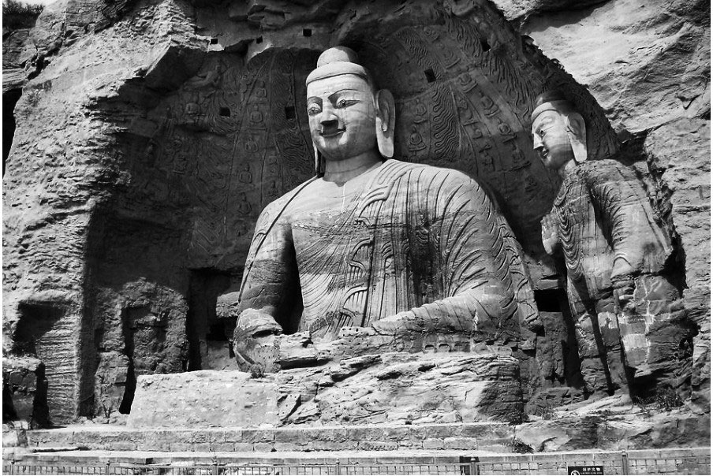

*1 云冈第20窟露座大佛 主佛高13.8米。云冈石窟于北魏前期文成帝时（460年前后）开始营建。现存的昙曜五窟是这段时期开窟的石窟群，第20窟位于五窟中最西，展现出昙曜五窟的宏伟气魄*

秦汉帝国之前的春秋战国时期也绝非单纯是“乱世”，那个时代有所谓的诸子百家争鸣，那时候的人意气风发，充满活力。从这一点上看，魏晋南北朝时期可谓与之一脉相承。

### 活跃于乡村社会和中央政界的贵族阶层

从表面上看，这种“乱世”局面与文化上的绚烂状况显得相互矛盾，却又混杂在一起。我们应该如何理解这个时期？这可以说是本卷所探讨的一个中心课题。

魏晋南北朝时期一般被称为“贵族制”的时期。这固然是由于东汉末年的混乱中出现的身为贵族的文人知识分子既成为乡村社会的领导，又进入中央和地方政界的统治阶层，从而备受后人的关注，同时我们也可以看出，这段政治混乱的时代之所以能够呈现出丰富多彩的社会面貌，与这些读书人的作为不无关系。

换言之，正是因为有了这些知识分子凭着强韧的精神所发挥出的巨大作用，在漫长的“乱世”中，文明、文化之花才非但没有凋零，反而得以繁盛绽放，吐露芳华。

不过这一活力时代的创造者并非只是贵族。作为造成“乱世”的另一方推手，胡族对中华文明也起到了保护和发展的作用，尽管表面上看这种判断似乎有点似是而非。

另外，魏晋南北朝时期佛教的兴盛以及在拥有广阔未开发地的江南地区的大规模开发等方面所取得的进展，其背后则是不可计数的无名民众毫不倦怠的辛勤经营与劳作。

在本卷中，笔者也力图基于上述的视角对文明的演变和继承等问题进行探讨。

### 汉民族与非汉民族之间对立与融合的历史

我们知道，这个时期出现了世界性的民族大迁移活动，例如欧洲日耳曼民族的大迁徙。在中国，发生了被称为五胡的民族（匈奴、鲜卑、羯、氐、羌）之大迁移，甚至还有学者认为，引发日耳曼民族大迁徙的，便是侵入西方世界的匈奴人。

以这种“民族”迁徙时期的观点来审视这个时期时，我们究竟能够看到些什么呢？思考这个问题时应当提请注意的是，中国有着日本不可比拟的诸多民族——尽管我们不能说在日本完全不存在这种情况——自古以来便在这片大地上繁衍生息，于是演化形成了中国的历史。

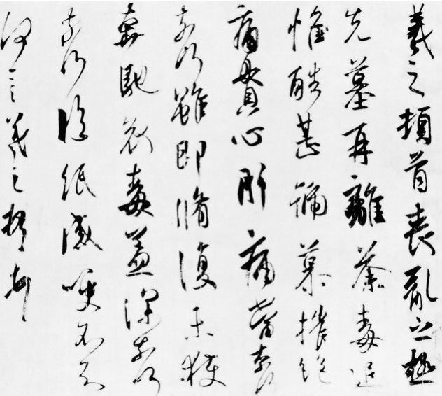

*2 王羲之《丧乱帖》（宫内厅三之丸尚藏馆藏）集王羲之的书简于一卷的书法作品。虽然不是王羲之的真迹，但被认为深具王羲之的笔法神韵。原藏于正仓院*

这一点从现在中国有蒙古、壮、苗等五十六个民族的情形便能容易看出。在中国现有的五十六个民族中，占人口大多数的民族是汉族。

然而，在考察汉民族的问题时，我们也不能忘记，历史上汉民族本身也是经过与其他各民族的抗争与融合，才一步步形成现在的格局和状态。例如，我们很容易就能发现现代中国北方和南方的汉族之间存在形质上的区别（比方说北方人的平均身高比南方人高），还有北京官话、粤语等多种多样的方言，并且存在川菜、粤菜等多样性的饮食文化。

十二世纪宋代著作《容斋随笔》中记述道：古代周的时期，中国的疆域最为狭小。就如今（即宋代）的地域而言，吴、越、楚、蜀、闽均为蛮夷之地，淮南也属蛮地，秦则是戎地……洛阳为天下之中心，为王城之所在地，然而其周边有杨拒、泉皋、蛮氏、陆浑、伊雒等戎族。此后成为宋朝皇都的开封，原本生活着莱、牟、介、莒等夷族……当时可称作中国的地域，仅为晋、卫、齐、鲁、宋、郑、陈、许等国而已，全部加起来……不过是宋代天下的五分之一。

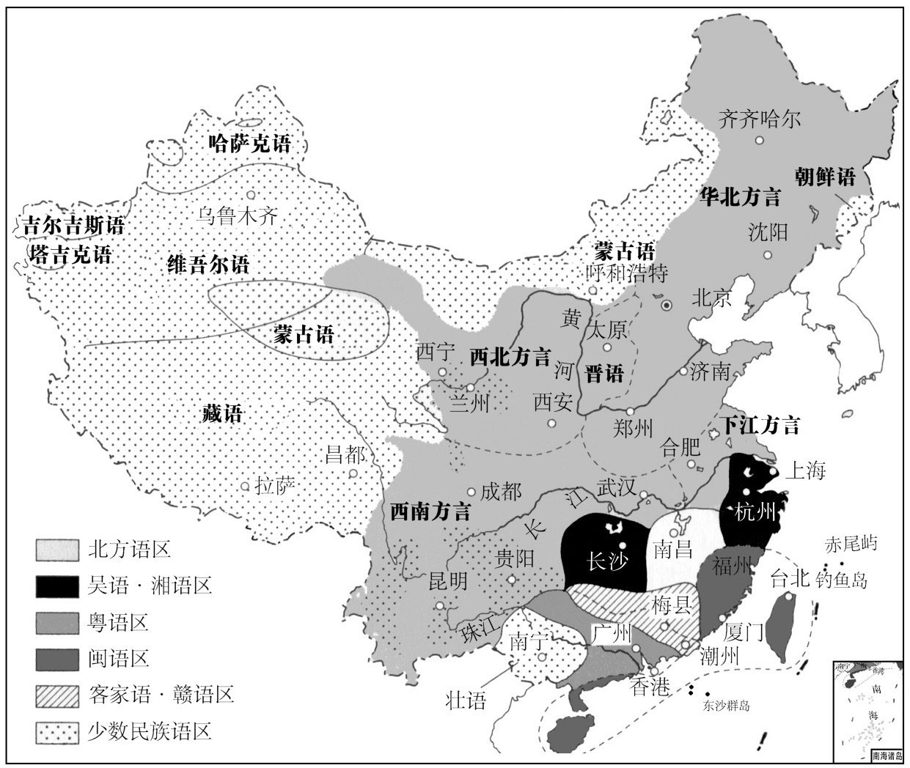

*3 中国的方言分布（参考周刊朝日百科《世界的食物》）现代汉语分为北方话、吴语、粤语、闽语、客家话等五大方言*

这段文字是站在宋代对古代周朝的回顾。换言之，在比春秋战国更早的时期，与宋代相比，所谓的“中国”其范围极为有限。

然而，当代中国的疆域进一步扩大，包括西藏、新疆、蒙古南部以及过去的满洲等地区。由此看来，我们不得不说，宋代的“中国”与现在的范围相比，只能算是“狭小”的。

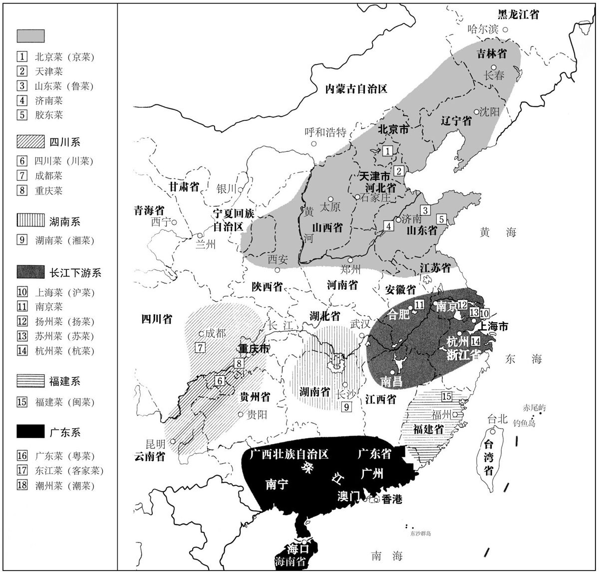

*4 中国菜系分布（参考周刊朝日百科《世界的食物》）*

经过历史的变迁，当今中国境内居住的人口中，汉族占十分之九以上，这种状况真实地反映了汉族自身经历了过去与上述各个民族之间的融合，才形成如今的状态。

以这种观点考察“民族”时期的魏晋南北朝时，我们应该如何在整个中国历史中对这一时期进行定位？这个问题也是本卷力图探讨的一个课题。

从用语上来说，在中国历史上第一次维持超过四百年统一的汉帝国出现以前，被称为“汉族”的民族尚未出现。自汉帝国以后，经过与诸多异民族和异文化之间的对立和融合，汉族的文化和文明发展演变至今日。

运用这种民族形成的视角对魏晋南北朝时期进行分析梳理之后，这个时期将会有什么样的真相浮出水面？我在本卷中，试图对这一课题进行研究。

### “中国化”浪潮及其历史意义

然而，魏晋南北朝时期由于中原的战乱，引发了规模庞大的人口迁徙和移居。这股浪潮从北亚地区向华北、继而从华北向江南、从华北向朝鲜半岛等，波及东西南北各个方向，这一迁徙的焦点是作为黄河文明摇篮的华北平原。正因为如此，这个地区深受暴力和破坏的严重伤害。

因战乱逃亡而产生的大规模迁徙人潮，集中地涌向了江南，结果使得这片此前尚未开发的广袤区域得到迅速开发，对此后中国历史的发展产生了极为深远的影响。现今中国出现北京（政治中心）和上海（经济中心）这种政治中心和经济中心分离的格局，其中一个渊源，可以追溯到这里。当然，人口向江南等地区的移居所造成的格局变化并非就此打住，它还给以中国为中心的东亚地区带来了其他种种重大的变化。其中的一个变化，即是中国周边地区在广义上的“中国化”进程。

例如，据被认为成书于日本镰仓时代的古籍《拾介抄》记载：“京都……东部号曰洛阳城，西部号曰长安城。”书中出现的“京都”无疑是日本的京都，然而日本人却用“洛阳”作为日本都城京都的雅称。而历史上把进京称作“上洛”，还有《洛中洛外图屏风》（狩野永德作）等作品，这些都清楚地表明“洛阳”留在京都的痕迹。然而，众所周知，洛阳可谓是中国都城中的都城，正如其又被称作“土中”（中国的中心）那样，洛阳长久以来一直都被视为“中国”、“中华”的中心。

日本人将自己的国都京都比作洛阳，这说明在古代日本，存在与中国同样的中华思想，即以中国的思想为范本的中华思想。

在我们追寻日本古代国家形成的轨迹时，可以发现这种推断是可靠的，而在日本形成这种中华思想的过程中，本卷所研究的魏晋南北朝时期的发展趋势，在其中发挥了极为重大的作用。

除了日本以外，当时中国的周边地区、高句丽、百济等同样也出现了“中国化”的趋势。对这种“中国化”的实际情况及其影响的历史意义进行阐释，也是本卷力图探讨的另一个课题。

---

# 第一章 魏晋南北朝时期之序幕

## 奔向新时代的滚滚浪潮

### 公权力之私有化与“公”之再建构趋势

魏晋南北朝时期是夹在秦汉和隋唐两个大统一时期的一段“乱世”。长达四百多年的秦汉帝国时代，自东汉中期以后便开始衰退，紧接着陷入了东汉末年及三国时期的混乱时代以及比起东汉末年及三国时期有过之而无不及的五胡十六国分崩离析的时代。

因此，如何消除混乱、构筑新的和平时代，可以说是这个时期所面临的一个根本性问题。

从大格局来看，秦汉帝国长期的和平局面，使中国的社会、经济、文化受惠极大，中国作为东亚古典文明发祥地，在文化和经济上取得了巨大的发展。这种发展的成果惠及社会各个角落，平民阶层也广泛受益。其结果，财富的创造和积累以前所未有的规模，从国家层面向平民阶层逐渐推进。

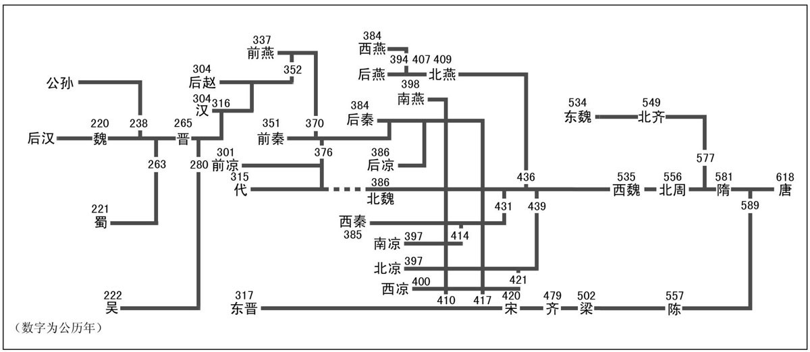

*5 魏晋南北朝王朝兴亡表*

随着这种状况的发展，在原本经济水平上几乎没有差别的平民阶层中，也出现了广泛的贫富差距，从而产生了阶层分化的新局面。

这种阶层分化在地方社会中普遍催生了形态各异的豪族阶层，其中上层的人士跃升到地方和中央的政界而成为官宦，地位进一步得以巩固。然而，这种由各阶层所构成的国家和社会的“分层化”，对于一君万民、主权在君的秦汉帝国类型的国家而言，可谓是对政权存立本身都有影响的结构性变化。

之所以这么说，是因为秦汉帝国的基本原则是，在唯一绝对的皇帝统治下，存在着数量庞大、基本上是均质的民众，凭借他们缴纳的赋税和所服兵役，国家财政和军政得以维持，而财政和军政的执行，则托付给皇帝的仆人，即作为“王之耳目”、勤勉于国事的官僚群体。

这种一致性逐渐瓦解并形成分层，其上层则逐步向地方和中央晋级并巩固其地位，朝着否定“一君万民”结构的方向突破，社会和国家可以说一步步滑入极为不稳定的结构当中。

更直白地说，这时出现的豪族阶层将普通平民拢入自己的势力范围之中，将本来应当集中到国家层级的税收纳为己有，这种局面在全国范围内的不断纵深发展，是东汉至魏晋南北朝时期的产物。这种局面固然引发了公权力的弱化，然而正如我们可以从外戚、宦官或异族对朝政的专断以及由此所产生的混乱中所看到的那样，公权力本身也经历着权力私有化的冲击。

另一方面，在汉代推行儒教国教化之后，涌现了具有儒教素养的官僚群体以及作为其基础的全国各地规模庞大的官僚预备军。割据一方的各地豪族中，也出现了为数不少的以儒教素养为根基、誉满天下的名人高士，他们对垄断、兼并平民土地等对公权力的破坏行为表示抗拒，在乡里社会的支持下，成为集结点。

这种行动最后对朝政的发展也产生了影响，而东汉末年党人的集结大概可说是其中最早的事件。

公权力私有化的潮流，以及立足于乡里与之对抗并由此力图对“公”实施再建构的行动，可说是汉代社会瓦解过程中所产生的时代的不同两面，这也成为这个时期群雄割据、动荡不安的一大根源。

因此，对于魏晋南北朝的国家而言，为了消除这种不稳定性从而重新统一中国，如何突破这种结构可谓是其中的关键所在。

这个时期所面临的问题并不仅仅只有我们现在所讨论的这一个。前面讲到，汉代长期的和平使中国的社会、经济、文化受惠极大，中国作为东亚古典文明发祥地，在文化和经济上取得了巨大的发展，这种文明之光亦普照到中国以外的东亚、北亚等地区。

这表现为作为文明中心的中国对中国以外地区的各民族有着极大的吸引力，而东汉末年中国愈演愈烈的混乱局面又推动了这种状况的进一步发展，大量的非汉民族向中国内地迁移或入侵。

换言之，当时非汉民族与汉民族这些不可调和的集团混杂分布于中国的大地上，这种现象成了日常状态，必然导致各集团之间激烈的冲突。于是如前所述由马赛克般分层所组成的国家，在这种混乱和冲突面前便显得不堪一击。因此，如何解决汉民族与非汉民族之间的对立局面，可谓这个时期所面临的另一问题。

人们处在这个混乱、动荡不安的社会、国家中，深切地关注自己的内心，同时执著地追求精神和灵魂的救赎。当时人们潜心于诗文绘画等艺术中，倾心笃信佛教和道教，这在某种意义上可说是这个时代的必然。生活在这个时代的人们的精神状态，与刚才所述的这一时代所面临的问题之间，存在着联动的关系。

那么，这个时代的人们当时是如何对待这个问题的呢？让我们开始一段旅程，进入这个波澜壮阔的画卷般的世界吧。让我们从“三国”的时代开始，先概述一下本系列第四卷《三国志的世界》中所讲述的经过。

### 东汉末年爆发的民众大叛乱：“黄巾之乱”

东汉中期以后，天灾和饥馑接连不断，从二世纪上半叶汉顺帝在位时起，几乎每年各地都会爆发农民反抗运动。此外，士大夫、宦官之间的对立导致内政纷乱，民众疲惫不堪。其中爆发的最大规模的农民反抗运动是黄巾之乱。

之所以称之为“黄巾军”，是因为参加起义的人都用黄布包头，其基础组织是河北省钜鹿人张角所创立的太平道。东汉顺帝时期，有个名叫干吉的人得到一本神书——《太平清领书》，传播神仙之教。张角在此基础上加入民间信仰，倡导太平道这种宗教。

张角声称自己是黄天之神的使者，自称大贤良师，通过护符和灵药为受疾病之苦的人们进行治疗，向民众宣扬通过反省罪过和忏悔实现救赎，并派遣弟子到各地，扩大太平道的网络。当时，对生活、疾病怀有不安和恐惧的贫苦大众，以及豪族阶层都深受太平道的吸引，在公元170年后的十多年间，从华北东部到长江流域，信众多达数十万。

当时深陷政治斗争泥潭的政府对这种局势的发展感到大为惊慌，屡次对太平道进行镇压，并责令其解散。然而，这反而促进了信众的团结，强化了其反政府的特性，最终与当时民众中酝酿的反政府情绪相结合，发展成以革命为目标的运动。

184年（中平元年、东汉灵帝甲子年），他们终于以“苍天已死，黄天当立”为号，以分布在全国各地的组织——“方”为核心，一同揭竿而起。面对这次全国性的反抗运动，中央暂时停止了朝廷的权力斗争，全力镇压黄巾军。碰巧当年秋天张角病死，尽管由于失去了这位能干的领导人黄巾军的主力衰落了，但是火势已在各地熊熊烧起，在混乱中乘势而起的地方黄巾军以及与黄巾军相互呼应的各地农民军，仍然具有强大的力量。其中最具实力的是河北的黑山军以及在陕西、四川等地活动的五斗米道的军队。朝廷又经过长达二十年的时间，才把这些农民军镇压下去。

### 从肃清宦官势力到群雄割据

平定了黄巾军的主力部队之后，朝廷上外戚和宦官之间的权力斗争复又上演。不过，189年外戚何进等人密谋的诛灭宦官计划泄露，何进被宦官所杀，何进的部下、出身名族的袁绍于是反过来将两千多名宦官全部杀掉。至此，之前把持大权、垄断东汉朝政的宦官势力被肃清，历史进入了一个大的发展阶段。

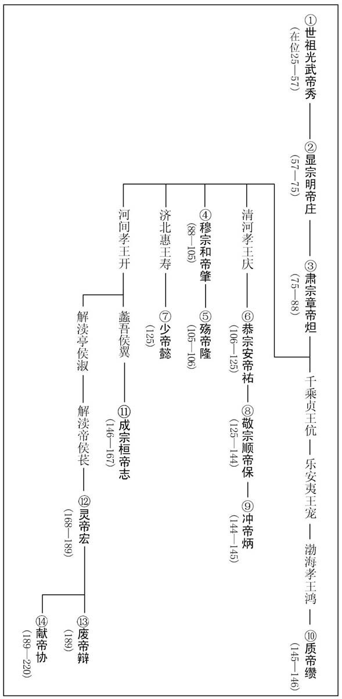

*6 东汉系图*

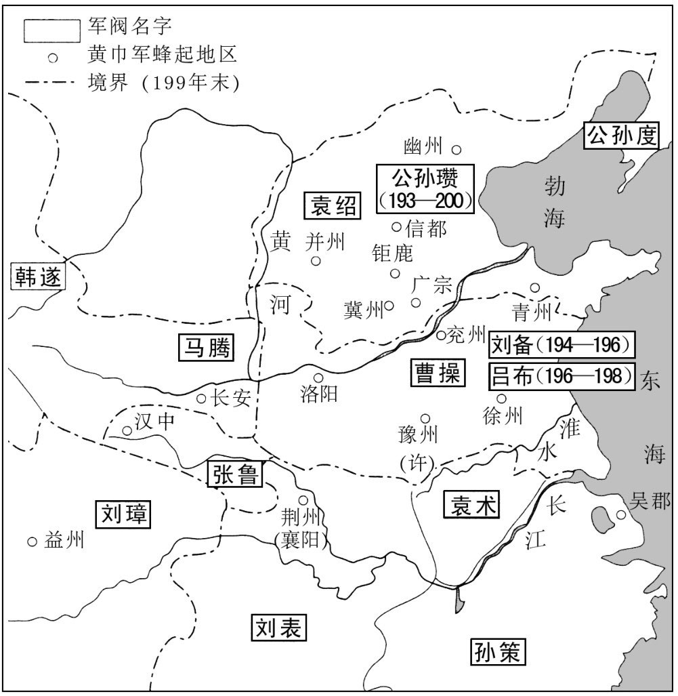

*7 东汉末群雄割据图*

在何进密谋诛灭宦官时，甘肃省临洮这个地方出了个叫董卓的人物。他与当时逐渐强大的羌族联合，率领强大的军队，观望着时局。随后到了189年，董卓配合何进的诛灭宦官计划，向洛阳进军，拥立汉献帝，掌握了政权。

然而，董卓的施政非常暴虐，190年，若干军队组成讨伐董卓的联军，推举袁绍为盟主。为此董卓将都城迁到长安，但其暴政并无收敛，最终被部下吕布所杀，局势越发混乱不堪。

经过黄巾之乱以及随后的董卓暴政，汉室名存实亡了，天下进入了群雄割据的时代。其中，出身汉朝四世三公的汝南汝阳（今河南省商水县）名门望族的袁绍于191年以邺（今河北省临漳县）为根据地，称霸黄河以北地区。

然而，不久曹操便在黄河以南的地区开始发展势力，于是当年曾一同团结在讨伐董卓旗下的曹操和袁绍，两人之间的对立便急速加深，以至于200年在官渡（今河南省中牟县）展开了激战。官渡之战以曹操的胜利告终，此后袁绍的儿子之间发生内讧，曹操在华北地区确立霸权更是势如破竹。

### 魏、蜀、吴三国鼎立的形成

曹操将汉献帝迎奉到许，不久又谋划将势力扩大到长江中游。不过，他的企图被因讨伐黄巾之乱而获得功名的刘备以及在江南割据一方的孙权阻止。

当初刘备流落在群雄之间时，曾投靠荆州的刘表。刘表一去世，曹操便挥师南征。刘备为了抵抗曹操，采纳了诸葛亮（孔明）的策略，与当时倾向于对曹操主战的孙权结成同盟，在赤壁之战中大破曹操的军队（208年）。

此后，曹操将势力延伸到关中，控制了华北全境，企图对蜀地发起进攻。当时益州牧刘璋请求刘备入川支援，刘备攻陷刘璋地盘，将益州据为己有。此时，刘备却与孙权之间就长江中游的要冲荆州的归属发生冲突，刘备与孙权之间的同盟关系遭遇挫折。

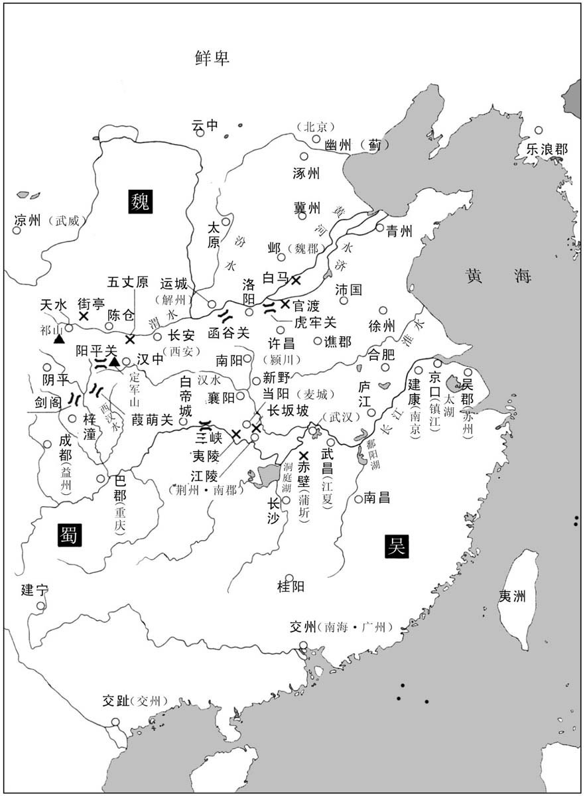

*8 三国时期关系地图*

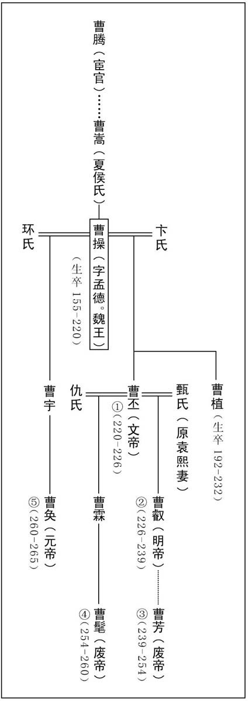

*9 魏（曹氏）系图*

孙权与曹操联合，谋划夺取荆州，袭击蜀军守将关羽，成功夺下荆州。至此，三国鼎立的局面形成（219年），魏（曹操）占有华北，蜀（刘备）据有四川，吴（孙权）则控制着荆州以东的地区。

次年曹操去世，其子曹丕（文帝）逼迫汉献帝禅让帝位，建立了魏国。得到这个消息，自称为汉室末裔的蜀国的刘备，也随后称帝（221年）。吴国的孙权即帝位的时间稍晚，那是229年的事情。

刘备即位后虽然力图夺回荆州，但未果病逝。诸葛亮辅佐刘备的儿子刘禅，与魏对峙。虽然诸葛亮善战，但在他去世后蜀国的国势不振，263年魏军攻陷成都，蜀灭。

然而，魏国自身在第二代明帝以后国势便逐渐衰败，而同时权臣司马懿（仲达）势力日增。最终在265年，魏国被司马懿之孙司马炎所灭。

另一方面，统治着江南的吴国围绕着孙权继承人的问题在朝廷内部发生争执，此后朝政混乱，国力渐衰。随后，魏晋革命得手的司马炎在280年平定吴国，成功使中国再次统一，始于东汉末年的动乱至此结束了。

### 地方长官握有军事权力的政治体制

如前所述，东汉末年涌现了大批豪族，而东汉末年割据一方的群雄大多依靠这些地方豪族获得兵源。群雄的军事基础，正是这些在西汉、东汉时期发展壮大的豪族势力。然而，各地群雄在扩大其势力时，绝没有忽视当时所存在的汉家体制。曹操拥戴东汉献帝，标榜其正当性，以实现其野心；刘备标榜辅弼汉室，建立蜀汉政权。这些都可说是在名义上利用原有体制的象征性事例。

东汉末年的群雄大多身为汉室官僚，努力争夺地方长官的地位（州牧、刺史），并以此作为自身势力正当性的根据。刺史原是由中央派遣到地方的监察官，不久就变成驻扎在地方负责行政的长官，成为东汉末年拥有豪族势力和军事实力的集团领袖，这是其一大特征。地方长官刺史掌握了军队，这种局面一直维持下去，成为魏晋南北朝时期特有的政治体制。

在考察这一时期时需要注意的是，袁绍、袁术、刘璋等汉王朝的名士相继灭亡，而曹操、刘备、孙权这种难以称得上是名士的战略家群体则胜者为王。

自东汉起，豪族阶层在地方和中央逐渐扩大和巩固其势力，这的确是魏晋南北朝时期的一大特征，而当我们审视三国时期时，则当注意，曹操起用人才的唯一标准是才能，而无视品行。刘备、孙权等人在选用人才时虽不像曹操那么彻底，却也大致如此。

后来由于贵族制影响日强，这种做法被迫中止，不过我们可以说，当老迈的汉帝国逐渐衰落乃至崩溃之时，唯才是举的选士方式体现了从过去的传统中解放出来的新时代的一个侧面。

### 九品官人法

九品官人法这种官吏选用法创始于汉魏革命的前夕。这一制度表现了在新时代来临之际，根据与此前完全不同的方针创建国家制度的强烈意愿。

这一官吏选用法以一品到九品共九个等级，作为担任官职的依据，因此称为九品官人法（后来也称为“九品中正制”）。220年曹丕接受汉献帝的禅让建立魏王朝时，其重臣陈群（？—236）为了根据个人才能和德行将汉朝官僚吸纳到新政府中，建议实施这个办法。曹丕接受了其建议，推行九品官人法，此后九品官人法也成为整个魏晋南北朝时期一直采用的选士制度。

这种选士制度一改汉代所实施的以秩100石、秩2000石等为秩禄的等级制度，将中央官职分成一品至九品的级别，称之为“官品”。并在地方的郡中设立中正官，令其对该郡出身的现任官吏或有希望出仕为官之人，在乡里舆论的基础上进行调查，将其才能和德行的高下分为与官品相仿的一品至九品，向中央报告。这被称为“乡品”，中央根据中正官的报告选用人才，授予其九等乡品所对应的合适的官品职位。

九品官人法在汉魏革命实现后仍继续使用，随后演变成专门适用于地方豪族或贵族的子弟最初担任官职即所谓的起家时的一种制度。相应的，原则上以低于乡品四等的官品起任，例如乡品二品的人从六品官起家，最终升迁到与乡品同级的官品。

这个时期适逢各地豪族顺应东汉末年以来的趋势、努力扩大各自势力并在上层豪族中形成特权的贵族阶级之际。九品官人法这一起家制度，正是在这样的背景之下产生的。

前面讲到，九品官人法的初衷是为了根据乡里的舆论按才能和德行选拔人才。然而，当这种设计在执行中变成趋炎附势的起家制度时，其根本精神便被歪曲了。

贵族豪族阶层依靠这个制度，在中央和地方的政界不断巩固其磐石般的势力。自东汉末年以舆论为基础的公权恢复的趋势至此，在贵族门阀化的走向面前发生了一百八十度的大转弯。

---

## 司马氏时期

### 司马懿的登场

179年，司马懿出生于河内一户名门望族。后来，他作为魏军的统帅与诸葛亮在五丈原对战，奠定了统一三国的西晋王朝的基础。司马懿出生时正值东汉末年，社会动乱之前夜。当时儒家官僚遭受宦官势力的镇压，因“登龙门”的典故而广为人知的士人领袖李膺等人被捕入狱，史称“党锢之禁”（169年）。不久黄巾之乱（184年）爆发。

司马懿的家世自称是秦灭亡后与项羽、刘邦等同期活跃在历史舞台上的殷王司马卬之后，到了东汉时期，司马氏已成为郡守辈出的名族。司马氏家族与曹操的关系早在司马懿的父亲司马防的时候就已建立，他本人则在208年到曹操手下供职。此后担任曹操的参谋，并辅佐曹操嫡子曹丕，在曹操的丞相府中确立了自己的地位。

220年，一代英雄曹操去世。在由此可能引发政情混乱之际，作为丞相府的司马，司马懿管理丧葬诸事，接着在拥戴曹丕继任丞相并夺取帝位（即位后为魏文帝）的过程中立下大功。因此，司马懿深得魏文帝的信任和器重，甚至被文帝比作汉高祖刘邦时期的宰相萧何。

重用司马懿的魏文帝作为一位有名的文人皇帝，曾如此论述和颂扬文学的价值：“盖文章者，经国之大业，不朽之盛事。”226年这位皇帝临终时，将刚立为皇太子不久的曹叡（魏明帝）托付给宗室曹真、曹休、建议实施九品官人法的陈群以及司马懿等四人后，便一命归西了。

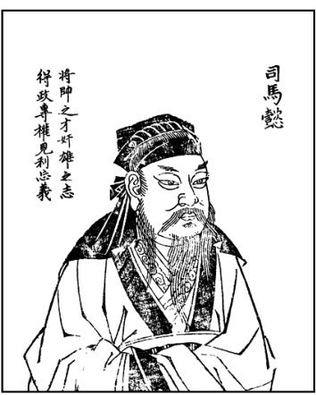

*10 司马懿（历代古人像赞）*

这时，诸葛亮向对此政治形势感到不安的魏国边关守将孟达派遣使者，劝说其归顺蜀汉。孟达为此所动准备反叛魏国，对此司马懿巧施谋略镇压了这起谋反，成功地挫败了诸葛亮的北进之志。

这一次诸葛亮并没有与司马懿直接过招，这个回合可谓从228年起到234年诸葛亮在五丈原的阵中去世为止蜀国所进行的五次北伐战争的前哨战。就这样，司马懿担负着魏国军事行动的最高责任，与蜀国的诸葛亮对峙，直到234年诸葛亮在五丈原去世，成功抑制了蜀国的威势。此后，司马懿掉转马头，于238年讨伐东方辽东地区的割据势力、屡次与吴国联合攻打魏国的公孙渊。而司马懿在魏国内的威势则稳如磐石。

据正史《三国志》的记载，就在这时卧病在床的明帝召见回到河内的司马懿，握着他的手说道：“吾疾甚，以后事属君，君其与爽辅少子。吾得见君，无所恨。”随后驾崩。

司马懿接受遗诏辅佐新皇帝齐王芳，却与同为顾命大臣的魏朝宗室曹爽不和，事态愈演愈烈，甚至发展到司马懿的实权一时被剥夺的程度。

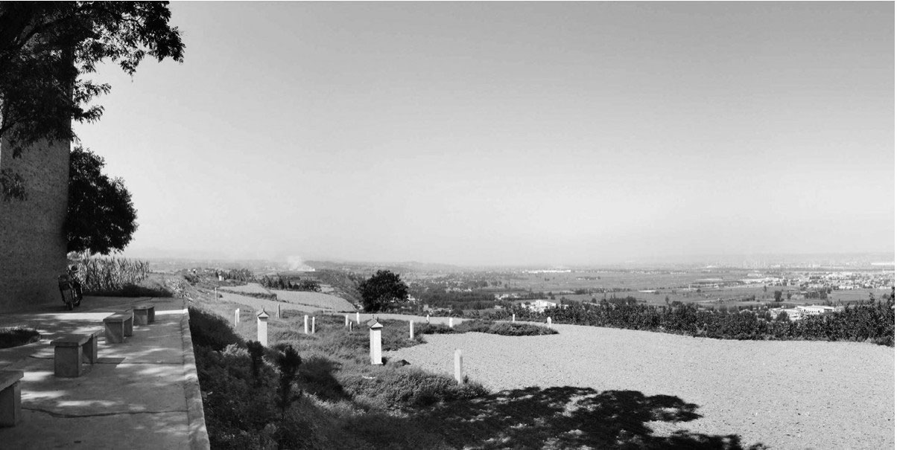

*11 从五丈原远望渭水 诸葛亮为了与司马懿对战，在五丈原布下阵势。五丈原北临渭水，东西都是深沟，有石头河、麦里河流过，是面积为100多平方公里的一处台地*

### 虚虚实实明争暗斗七旬老翁夺取权力

然而，249年司马懿却通过政变诛灭了曹爽一派，将魏国的实权完全掌握在自己的手里。在本系列的第四卷中也有介绍，这段时期司马懿与曹爽之间展开虚虚实实的明争暗斗，从史书记载的以下片段中可窥一斑。虽然这段记述真伪莫辨，但时至今日我们依然能够明显地感受到当时的紧迫状况。

247年四月，司马懿之妻张春华去世（年五十九岁）。五月，司马懿称病，不再过问朝政。曹爽阵营中的一人、国都所属辖区河南郡的郡守李胜被任命为荆州（湖南省）的长官，假装前来向司马懿告别，实际上是为了探听他的虚实。当时，司马懿在两个婢女的搀扶下出来迎接，衣服却从手上滑落。他用手指了指嘴，意思是口渴了，婢女把粥端上来后，司马懿不用汤勺，直接端起碗喝，粥全都流了出来，弄湿了胸口。李胜说道：“听说太傅旧病复发，却不曾想有这么严重。”司马懿气息奄奄地说道：“年老卧病在床，死期将至了。你说你要被派到并州（今山西省），并州离北方胡人的地方很近，请多加防备。恐怕下次你回来就见不到我了。我的儿子司马师、司马昭兄弟还请你多关照。”李胜回答说：“我要去的是老家荆州，不是并州。”但司马懿仍然弄错了，问道：“你要去并州吧？”李胜只好再说一遍：“我被任命到荆州。”司马懿回答道：“我年纪大了，头脑不中用了，刚才没听清楚你的话。原来你是要回老家当长官呀！太好了，好好干！”李胜离开司马懿家，紧急向曹爽汇报说：“司马公恐不久于人世，他的身体和精神已经分离。您可以放心了。”

然而，249年正月初六，齐王芳（废帝）外出拜谒明帝的陵墓，曹爽阵营的人全都跟随皇帝一同前往。司马懿伺机发动政变。结果，曹爽及其所有党羽全家一同被拉到闹市处斩。至此司马懿的霸权形成，上边下诏任命他为丞相。这时司马懿七十一岁，在当时来说是稀有的高龄。

### 司马师、司马昭兄弟的时期

政变两年后，251年八月，司马懿结束了其波折跌宕的一生。司马懿有九个儿子，继承司马懿事业的司马师、继承司马师事业的司马昭这两兄弟为其元配张春华所生（参看插图12）。

据说发动政变时，司马懿和司马师两人一起仔细谋划，司马师及其私下募养的“死士”三千人为政变的胜利作出了很大贡献，而在司马懿去世后，司马师是否有能力作为继承人担负起重任，后人不得而知。

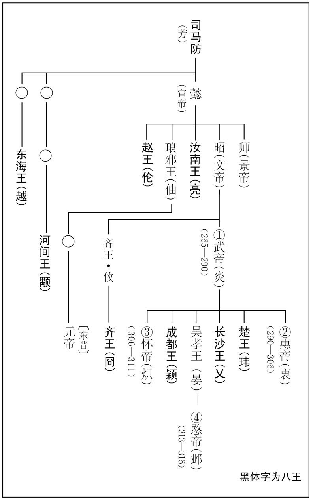

*12 西晋（司马氏）系图*

就在这时，252年魏国与吴国在东关展开大战，魏国大败。这是一次由魏国勇将毌丘俭、诸葛诞等所领军的大规模对吴作战。魏军被当时吴国大将诸葛恪的军队击溃，这时朝廷准备对从军的诸将问罪。

然而，司马师却说：“不听谏言才落得这个地步。这是我的过错，诸将何罪之有？”史书记载，由于司马师自己承担败军之罪，众人感到羞愧，佩服其度量。对于这一举动，《资治通鉴》的注释人、著名的胡三省给予了辛辣的评价：“（司马师如此言行）是为了巩固自己的权力。盗贼也有道，更何况司马师盗的是国家！”

254年二月发生了一件事，中书令李丰等人密谋反对司马师，事情泄露后，与此有牵连的人都被处死。皇帝（齐王芳）也参与了这一事件，司马师借皇太后懿旨，斥责皇帝堕落，将其废黜。随后将文帝之孙、明帝之弟高贵乡公曹髦（被称为魏后废帝）立为傀儡皇帝。

然而，这一擅权的废立之举招致了在对吴战线的重镇驻防的毌丘俭、文钦等魏国众宿将的强烈反对，事态进一步发展，乃至于司马师亲自率军镇压叛乱（255年正月）。虽然打了胜仗，但司马师那只病眼却在战争中掉了出来，为了避免动摇军心，他隐瞒了病情继续领军作战，情形非常悲壮。司马师的病情进一步恶化，在叛乱的主谋毌丘俭死后，过了七天，司马师在班师回洛阳的途中，于许昌（今河南省许昌县东）病逝。

当时奉哥哥的命令留守都城洛阳的弟弟司马昭急忙赶到许昌。司马师在临终前将全军委托给司马昭，而皇帝（高贵乡公）却打出了起死回生的一招。他对司马昭下令说，由于东南之地刚刚平定，你暂时先在许昌驻守。同时又令尚书傅嘏率领待命的各路军队回师洛阳。

这是皇帝趁司马师之死而统帅暂缺之机发动的夺权行动。然而司马昭察觉出皇帝的意图，不顾高贵乡公的命令回到洛阳，二月司马昭就任大将军和录尚书事，达到军权和行政权的顶点。

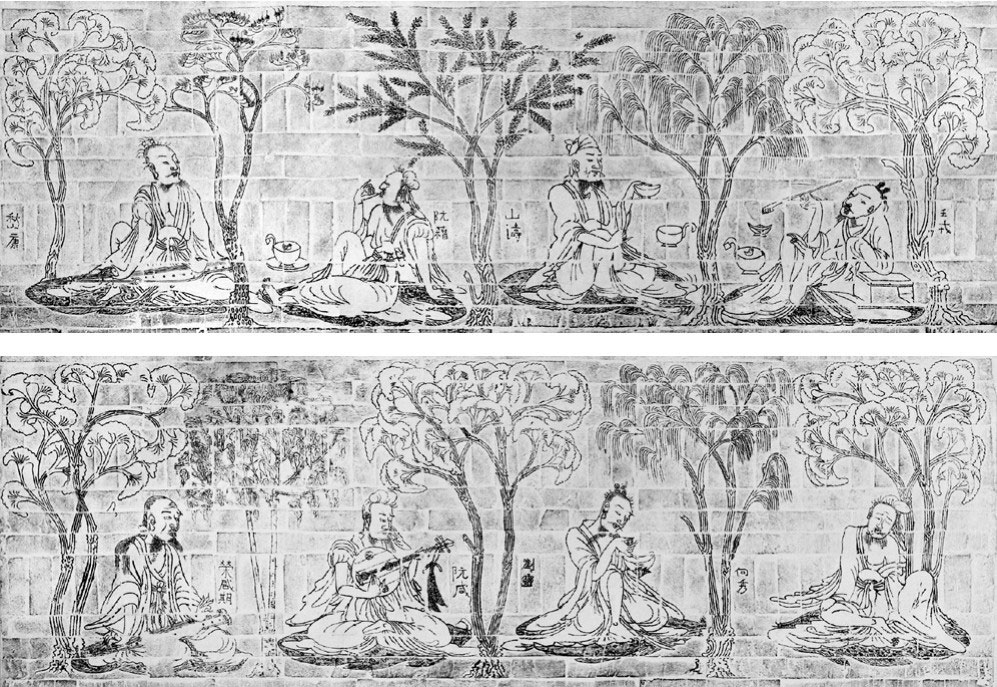

*13 竹林七贤 发自东汉末年清议的清谈，受到弹压后，在魏代更偏向于哲学上的谈论。所谓竹林七贤超逸脱俗的清谈也属于这一源流，在篡夺魏王朝的行动逐渐浮出水面之时，他们的清谈潜藏着对魏晋更替的政局的愤怒和忧虑*

当时，在毌丘俭死后，诸葛诞驻守在对吴作战的重镇寿春。他属于琅邪诸葛氏，与蜀国诸葛亮、吴国诸葛瑾（亮之兄）诸葛恪父子同族。司马昭一掌握辅政大权，便派遣心腹贾充去见诸葛诞，打探其动静。

于是，贾充试探问道：“洛阳诸贤都希望魏向晋禅代，不知您是怎么想的？”诸葛诞厉声回答：“君乃贾逵之子，枉你世受魏恩，怎么能够想到把社稷送给他人？倘若洛阳有变，我将以命相护。”结果，257年五月讨伐诸葛诞的诏令下来，司马昭奉皇帝和皇太后之命，派遣二十六万大军前去镇压。之所以假借皇帝和皇太后的旗号，其意图为的是在司马昭离开洛阳时防止出现拥立皇帝的势力。

通过如此缜密的作战安排，次年二月司马昭一方取得了胜利。诸葛诞被斩杀，全族被诛灭。据史书记载，诸葛诞的亲兵数百人，相邻两人交叉着手排成一列，对方每斩杀一个人都劝说其他人投降，然而谁都没有动摇，直到最后一个。

260年五月，即位五年多以来未能从司马氏手上夺权的皇帝（高贵乡公）死于非命，年仅二十岁。皇帝聪明好学，随着年纪渐长，对司马氏的专权越加愤懑，最终爆发。

260年五月己丑之日，皇帝召见近臣王沈、王经、王业三人，说道：“司马昭之心，路人所知也。吾不能坐受废辱，今日当与卿等自出讨之。”然而，王沈、王业马上将这个密谋计划向司马昭报告。

皇帝拔出身上的佩剑，带着几个宿营的兵士出击，贾充从外面来到皇宫，与皇帝在南面的门阙相遇。皇帝拔剑而立，贾充的随从怯而后退。据说，这时贾充对自幼被司马昭抚养成人的成济说道：“司马公养你何用？正为今日之事也！今日无论发生何事，概不问罪。”成济得此授意，上前将皇帝刺杀。听到皇帝被刺身亡的消息，司马昭大惊，晕倒在地。

就这样，司马昭使魏后废帝曹髦死于非命，而他慎重地判断舆论对此作何反应，随后以魏晋禅代为目标，积极讨伐在诸葛亮去世后日薄西山的蜀国，希望在世人的一片赞誉声中一鼓作气实现禅代。

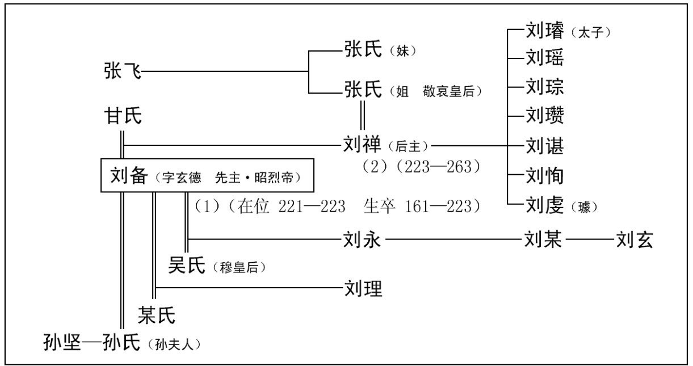

*14 蜀（刘氏）系图*

### 蜀国灭亡与司马昭进封晋王

在曹爽与司马懿争权夺势的过程中，魏对蜀的远征始终未能成行。然而，到263年五月，终于下达了征讨蜀国的诏书，八月从国内动员了十八万军队，由钟会等人率领向蜀国方向进发。

十月，钟会的军团控制了汉中，与防守入蜀咽喉之地剑阁（今四川省北部）的蜀国大将姜维对峙。另一方面，从关中南下的邓艾绕过剑阁，从阴平穿越崇山峻岭地带进入江油（今四川省北部），对蜀发动突然袭击，在绵竹大破诸葛亮之子诸葛瞻所率领的蜀军。蜀国对魏军的突然攻入和己方的大败感到非常吃惊，经朝议决定投降。刘禅亲自来到驻扎在都城成都北部的邓艾军营前，将双手反绑在背后，并用车载着一口棺材表示自己犯有当死之罪（面缚舆榇），向魏国投降（十一月）。

至此，蜀汉经刘备、刘禅两代四十三年而灭亡。此后，钟会与邓艾产生矛盾，与蜀国故将姜维联合发动叛乱，蜀地仍不时陷入混乱状态，但终究没人能够逆时代的潮流而行。

263年十月，平定蜀国的大势已非常明朗，这时朝廷下诏封司马昭为晋公，司马昭接受了。在此之前，尽管下面曾几次劝进，司马昭都坚决地推辞了，这时才接受了进封，是因为司马昭判断时机终于成熟，有了坚定的决心。

此后的行动便非常迅速。同样有禅代企图的曹操，从魏公到就任魏王等了三年时间，而司马昭则在成为晋公的六个月后便进为晋王（264年三月），五月将司马懿和司马师分别追谥为晋国的宣王和景王，十月将嫡长子司马炎立为晋国的世子。

另外，在264年五月，对五品官骑督以上的文武官员六百名分别授予了公、侯、伯、子、男的爵位，并根据爵位高低封给有爵位的人从五千户到四百户的食邑。这是为魏晋禅代做准备而对魏臣的一种“本领安堵”

到了七月，对礼仪、法令、官制等进行全面修订，禅让的准备基本就绪。然而就在这一关口，265年八月，司马昭突然去世，其子司马炎最终成就了禅代大业。

至此我们回顾了司马懿、司马师、司马昭父子三人利用权谋术数篡夺王朝的过程。历史上留下的几乎都是这场历经父子二代的政治斗争鲜血淋漓的情景。然而，在关于这个时代的史书中，我们也能看到与这种论调不大相同的评价。

东晋时期有一位名叫习凿齿的史学家，关于魏军在东关之战中遭受大败时司马师不问诸将之罪而一人承担所有责任一事，他作出如下评价：

这真可谓智者之举。倘若讳言失败推卸责任，归咎于各种原因，经常自伐其功而隐匿失误，使上上下下离心离德，各种人才分散解体，那谬误就太大了！

另外，孙吴的张悌评论道：曹操虽然功盖中原，却玩弄诈术，战事不绝。因此百姓畏惧他的威严却不感念他的恩德。曹丕、曹叡继承了这种作风，刑罚苛繁劳役沉重，在内大兴土木营造宫殿，对外连年征战不休。魏早就失去了民心。司马懿父子掌握大权后累建大功，废除苛政，实行对百姓较为平和有利的政策，为百姓谋划着想，解救他们的疾苦，民心归顺司马氏已经很久了。因此淮南（寿春）出现叛乱却动摇不到根本；曹髦（高贵乡公）被杀而死，四方也没有引起叛乱。而且能够任用贤能，使他们各尽其心。

这些不同的评价是根据什么历史背景而作出的？下一节我们将对这一点进行详述。

---

## 司马炎使中国再度统一

### 司马炎的登场

司马炎是司马昭的嫡长子，出生于魏青龙四年（236年）。其母亲叫王元姬，外曾祖父是魏国元勋王朗，外祖父是著名的思想家王肃。年轻时司马炎是一位贵公子，人称“宽惠仁厚，深沉而有度量”，甚至据说在根据九品中正制度评定乡品时，其出生地河内郡无人能比。

出仕后他历任祖父司马懿、伯父司马师曾担任过的官职，264年被立为晋国的世子，进而在父亲去世后，于265年八月继任司马昭原来的晋王和相国的官爵。紧接着在十二月终于接受魏帝（元帝）的禅让，即帝位（十七日），改年号咸熙（魏）为泰始。

当我们审视司马炎初期的政治时，首先值得注意的一点是，他所任命的重臣大多是学识与礼教并重的名望人士。这与曹操重才干轻德行的方针大为迥异。司马炎即位后，马上送出了一道厚礼，恢复了因三国的混乱而一度中断的民爵赐予，而且一律提升五级。

民爵赐予是指汉代重视乡村的年龄秩序，赐予乡村的父老爵位和酒肉，并由父老在乡村的社中主持祭礼，由此实现国家营造下至平民、上至皇帝的国家成员的一体感和秩序化的目的。

司马炎的这份民爵“大礼”有着强烈的倾向性，其意图是在西晋王朝建国之初笼络民心。然而，我们在审视前述司马炎重视礼教的施政特色时，从中也可以看出其努力克服东汉末年至魏朝的苛政，构筑以礼教为基础的国家。

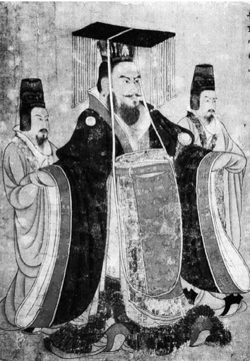

*15 晋武帝司马炎（历代帝王图）*

另外，司马炎在即位后的次月，即泰始二年正月，分封司马氏一族二十七人为郡王。魏朝除了魏明帝时期稍有缓和之外，根据曹丕的遗命，王族宗室之人一概不得就任官职，并始终处在国家的监视之下。曹丕与因七步诗而闻名的曹植兄弟之间的“相煎”便是这种宗室关系的一个明证。这种宗室抑止政策，从某一方面上看也是东汉末年以来同族之间难以互信的混乱时代的产物。

然而，西晋时期却与此相反，允许宗室出仕甚至就任高官，且宗室所受到的优待不只如此。这种政策的推行，某种程度上具有强干弱枝的性质，而考虑到前面所说的魏朝情况，我们确实可以看出司马炎希望纠正魏朝的过酷政局，将政治建立在宗室之间团结友爱的基础上。

泰始元年，司马炎解除了汉魏时期宗室任官的禁令，对官员的任用显示出极为宽大的态度，例如任命曹植之子曹志为太守，任用诸葛亮的子孙为官等。这方面也跟他的政治姿态有关。

### 吴的灭亡与天下复归统一

吴国方面，在241年孙权晚年时，皇太子孙登去世，新皇太子孙和与备受孙权宠爱的孙霸两派的支持者之间的斗争愈演愈烈，最终不可收拾，发展到250年孙和被废、孙霸被赐死的结局。雪上加霜的是，不久孙权去世（252年），臣下之间的分裂进一步扩大。旧太子党的诸葛恪与孙霸派的孙峻、孙綝等人明争暗斗，专权擅势，吴王朝开始一步步滑向自我瓦解的边缘。

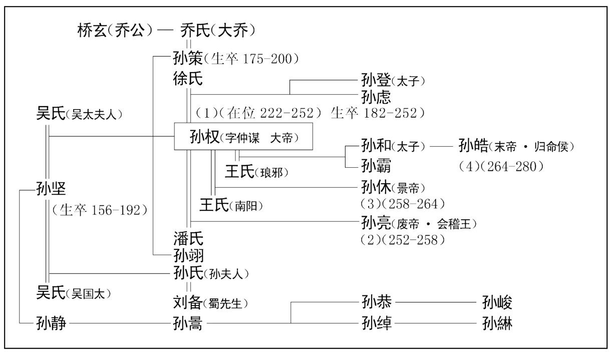

*16 吴（孙氏）系图*

在这种情形下，孙权之孙、年少的孙皓于264年即位。然而，他却不顾王朝濒于崩溃的危机，热心营造宫殿，不断实施残虐之举。这些所作所为大概反映了孙皓对王朝临近灭亡的不安以及年少皇帝为了确立权威而带有的焦虑，而他也就成了此后南朝各个暴虐的末代皇帝的嚆矢。

孙皓即位与司马炎称帝时间很接近。这是司马炎再次统一天下的一次绝佳机会。司马炎的心腹羊祜以及羊祜事业的继承人杜预等人大力劝说司马炎发动讨灭孙吴的军事行动。然而，朝廷内部持谨慎意见的人很多，在司马氏禅代中立下大功的贾充甚至对此表示强烈反对。其中的很多人之所以反对，只是因为他们有的是不希望帝权进一步加强的贵族阶层；有的认为讨吴的计划是皇帝与少数几个人之间的密议而自己被排斥在外，因而感到焦虑；有的觉得天下统一时自己无法参与论功行赏而心怀不满。

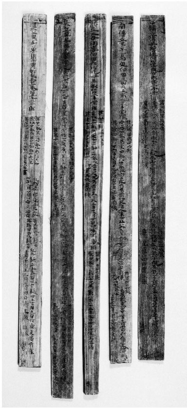

*17 走马楼木简 1996年，湖南省长沙市走马楼建设工地出土了大约10万件简牍，其中有很多吴简，期待取得研究成果*

这一点与后来西晋末年所蔓延的先私后公、惘误国事的风气可谓“一脉相承”，需要我们注意。不过结束东汉末年以来的混乱政局，使天下复归统一的计划如箭在弦，并没有构成其实施统一计划的障碍。

279年十一月，讨伐孙吴的诏书终于发布。东西两路大军二十余万人马从淮南和湖北一同南下，水军则从已成为晋朝领土许久的蜀地顺着长江而下。晋军很快在次年二月便攻陷吴国的江陵，三月攻入吴都建业的防守要地石头城，随后攻破建业。孙皓依照亡国之礼，肉袒面缚，向晋军投降。至此持续了四代五十二年的吴国灭亡，中国在晋代复归统一。

根据晋朝查抄的当时的记录，吴国共计户数五十二万三千，人口二百三十万，吏三万两千，兵二十三万。

### 军备撤废与户调式

武帝统一天下后，实施了两大政策。其一是军备撤废，即除了若干例外，将州郡所属的士兵解散归农。这项政策是为了从长期延续的战时体制回归到平时体制而在军事上进行的改革，有情况时便将驻扎在洛阳等军事要冲的中央军派遣到地方，旨在结束地方分权的军事格局。

其二，武帝制定了占田课田制的土地制度以及相应的征税制度。占田法规定，男子一人七十亩（约五公亩）、女子三十亩，按夫妇一户为单位向国家申领耕地耕种。另外，对于官员，第一品五十顷（一顷为一百亩），以下逐品递减五顷，到第九品为十顷，承认其耕地所有权，根据其身份制定土地所有权的上限，对大土地所有进行限制。

同时制定的课田制规定，按男子五十亩、女子二十亩、次丁男减半（二十五亩），各分摊应课税的土地数量

除了民屯以外，在近邻吴、蜀前线的淮南、关中等地则设置以军事为主要目的的军屯。司马炎称帝之后不久，军屯在魏晋革命时便废除，而民屯则在平定吴国之后便被取消，屯田民全部编入一般州郡的户口中，其负担也与普通民众齐平。然后在平定吴国之后又颁布了课田制，从这里可以看出课田制是以魏朝的旧屯田民为实施对象的，反映了政治方针从战时体制向平时体制的大转变。

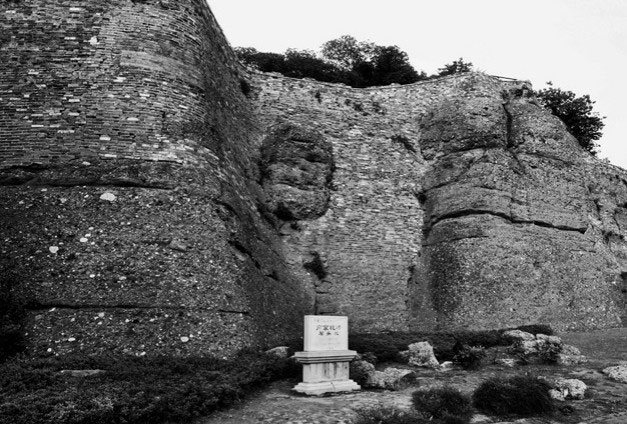

*18 石头城 位于南京城西北。南北全长约3000米。原为楚威王的金陵邑，筑于公元前333年，211年孙权重新在此筑城，命名为石头城。是建业（建康）攻防的要地*

通过占田课田制农民分配得到一定的土地，保证了再生产，并需承担义务，按户为单位向国家缴纳在耕地上生产的谷物（田租）和绢（调）。

280年武帝实施了基于占田课田制的户调式税法，将汉代人头税方式的课税变更为以户为单位，是一种划时代的税法。

### 除掉齐王司马攸的计划

齐王司马攸比司马炎小十岁，是司马炎仅有的一位同母胞弟。司马攸聪颖过人，受人爱戴，从小祖父司马懿就对他寄予厚望。司马懿让他过继给司马师做后嗣，也清楚地反映了这种心态。其父司马昭对他也多有关照，在生前曾表示：“我现在是替死去的兄长（司马师）代掌相国之位。我去世之后，大业应该由司马攸继承”、“这是景王的天下。我怎么能够取而代之呢？”然而，最终这一安排并没有实现，齐王司马攸在晋朝建立后，在朝政的中心一直没有受到重视。

天下统一两年之后，282年，司马炎命令齐王攸前往自己的封国齐国。其背景是兄弟之间的不和，这与曹操的儿子曹丕、曹植这两个同母兄弟一样。另外，司马炎的嫡子司马衷（后来的惠帝）是个政治低能儿，是后来引发八王之乱、导致中国大崩溃的一个关键人物。当时许多朝臣早就对此忧心忡忡，因此在司马炎的继承人选上，司马攸乃人心所向，被寄予了厚望。

在灭吴前的275年，国都洛阳流行疫病，死者过半，事态非常严重。司马炎自己也身患重病，一般认为正是从这个时候起，司马炎就认真考虑要将司马攸除掉了。

于是几年后就有了司马炎强令司马攸到其封国赴任，当时有许多朝臣谏言反对，然而司马炎禁止这种进谏，但凡提出谏言的朝臣都遭到降职等处罚，因此皇帝的一意孤行未被阻止。

司马攸自己对这个命令感到忧愤交加，终于生病。尽管司马攸身体有恙却仍被勒令启程，两天后在途中吐血身亡。震撼朝廷的事件就此告一段落，但自此以后不再有朝臣向皇帝秉言直谏，西晋王朝原来开明的舆论环境不可避免地变得闭塞了。

### 愚昧的皇帝司马衷

武帝之后即位的惠帝司马衷，是武帝与皇后杨艳所生的次子。其长子年幼夭折，在平定蜀国之后，267年正月，司马衷被册立为皇太子。

惠帝愚昧无能，在听到因战乱而无粮食的难民闹饥荒时，竟然问“何不食肉糜？”如前所述，从司马衷做皇太子时起，朝臣均已知其无能，重臣卫瓘在宴席上跪在武帝面前，摸着武帝的御座，叹息说：“这个座位太可惜了！”从这个故事我们可以清楚地看出，朝臣从这个时候起就对武帝逝世后司马衷能否承担起皇帝的职责表示怀疑。

武帝自己大概也不会看不出皇太子的问题，但据说由于亲生母亲杨皇后的宠爱，再加上对皇太子之子司马遹存有寄托未来的期待，便打消了废太子的念头。当时朝廷有的大臣希望废掉愚昧的皇太子，改由司马攸继承皇位，有的大臣主张由司马攸辅佐惠帝，掌握实权，总之对司马攸舆望甚高。然而，正如前面所述，武帝最终并没有采纳这些意见，而是选择了一条让舆论失望的道路。

后来，武帝晚年的朝政被杨皇后的族人杨骏所掌控，武帝死后杨骏出任辅政大臣，宛如东汉末年外戚专权的情形再现。

### 司马氏三代之功过

至此我们已经论述了司马懿父子通过权谋术数，实现了魏晋禅代的过程。这可以说是司马氏一族追求私利的结果。然而，另一方面我们也不能否认，他们生于东汉末年的动乱之中，作为具有儒教修养、名望很高的人士，也具有经世济民之志。

他们恐怕深刻地认识到舆论对于结束东汉末年直到三国时期严酷乱局的热切期望。前面我们所审视的民心从曹魏转移到司马氏，也与这种舆论的趋势有着密切关联。正因为如此，这种民心向背强烈地要求通过魏晋禅代而即帝位的武帝审时度势，排除私利，确立公权。

关于前面所论述的占田课田制，尽管研究者围绕着其实际情况存在各种不同的对立意见，但都不怀疑这种土地制度对豪族以追求私利为驱动的大土地所有制的限制，也认同这种土地制度的主要目的是为了保护遍布各地的自耕农的再生产。占田课田制还为此后北魏、隋唐时期的均田制所继承。另外，在司马氏三代间逐步确立了贵族制，在这种贵族制是根据当地的舆论形成的情况下，它对公权的再度确立发挥了很大的作用。

然而，与这种公权再确立的趋势背道而驰的是司马氏政权内部始终存在权力的私有化行动。例如司马炎即位后，马上恢复了因三国的混乱而一度中断的民爵赐予，希望由此实现国家营造下至平民、上至皇帝的国家成员的一体感和秩序化的目的。然而我们从一律提升五级的赏赐“大礼”中，可以看穿他企图以此诱导舆论的恣意心态。

皇太子与司马攸争位一事也明显地反映出在本应视为公权之要的下任皇帝选定上，司马炎存有私心。当此后局势一步步陷入外戚专权的深渊时，可以说后续时期混乱的端倪，已在此时若隐若现。

---

# 第二章 胡汉的抗争

## 五胡十六国时期

### 八王之乱与永嘉之乱

结束三国时代、使中国再度统一的西晋武帝司马炎于290年四月驾崩，从此中国就像从时代的斜坡上滑落一样，进入即便是在中国历史上也不多见的大混乱时期。首先是从西晋宗室的皇位争夺战开始。

武帝去世后，皇太子司马衷（惠帝）即位，由于他的愚昧，武帝的皇后杨皇太后任命自己的父亲杨骏为辅政，杨氏家族开始专权。然而，惠帝的皇后贾氏不甘受人摆布，便借助汝南王司马亮、楚王司马玮的力量杀掉杨骏，而后除掉司马亮和司马玮，掌握了实权。

政治斗争本身便是如此激烈的事情，在贾后夺取权力后不到十年的一段时间里，由于有名望人士张华、裴頠等人力挽危局，政治局势才勉强保持安定。

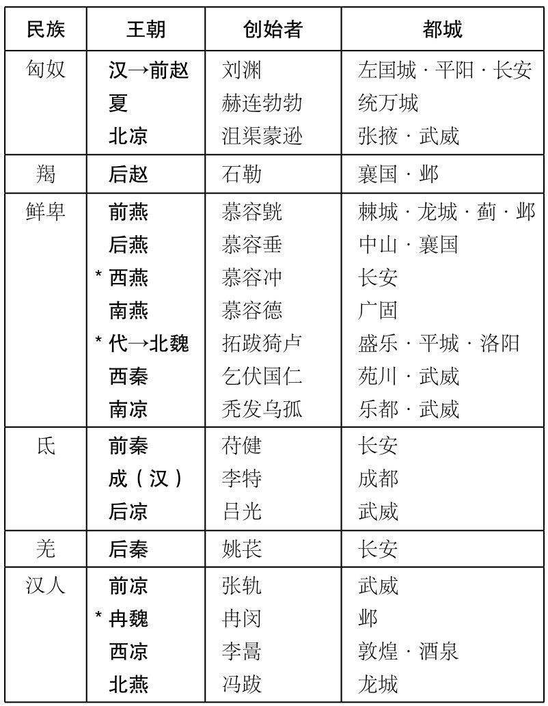

*19 五胡十六国王朝表*

然而，由于299年十二月皇太子司马遹被贾后废掉并杀害，朝野愤激，局面开始急转直下。300年四月，赵王司马伦铲除了贾后一派，次年一月幽禁了惠帝，自己即帝位。此举招致诸王的一同反抗、共同讨伐司马伦，诸王之间的斗争陷入了泥沼，中原一片大混乱。

这场大乱史称“八王之乱”，一直持续到东海王司马越拥立怀帝司马炽即位。这时不再服从中央威严的诸势力已在各地割据，西晋衰亡的惨状，竟至不堪入目的地步。

勉强支撑着西晋王朝的东海王司马越在311年去世，华北的混乱便揭开了第二幕。当时山西的匈奴王刘渊，利用羯族的石勒和汉族流民的首领王弥等人派兵席卷了河南、山东等地。石勒向由于东海王的去世而出现混乱的晋朝发动攻击，捕杀其将士十万余人。这时刘渊已死，其子刘聪即位，刘聪趁机派遣部下武将刘曜和王弥大举进攻洛阳，极尽掠夺暴行之能事（311年六月）。

当时的年号为永嘉，故这场动乱史称“永嘉之乱”，洛阳被战火烧光，被夺走性命的人多达数万之众。怀帝和玉玺也被掳至匈奴的老巢平阳（今山西临汾），惠帝的皇后羊氏被刘曜霸占。至此西晋事实上已经灭亡。

怀帝在平阳被杀，武帝之孙司马邺便在长安即位（愍帝），后也被匈奴攻击，同样被掳至平阳，317年，惨遭杀害。

### 五胡十六国的各个政权

永嘉之乱的主角匈奴于304年自立，国号为汉（后来的前赵）。从304年到439年匈奴政权北凉被鲜卑政权北魏所灭、华北再度统一，各民族、各政权相继兴亡的这一百三十六年间被称为“五胡十六国”时期。“五胡”是指匈奴、羯、鲜卑、氐、羌等五个民族。严格地说，这段时期兴亡更替的各个政权共有十九个，此后建立北魏、更改国号的代、短命的西燕、汉族建立的政权冉魏一般都不计算在内，前赵、后赵、前燕、前秦、后燕、后秦、南燕、北燕、西秦、前凉、后凉、南凉、北凉、西凉、成（汉）、夏等政权被称为“十六国”，后来与“五胡”连在一起，成为对这一时期的称谓。

“五胡”并非趁着前述西晋末年的混乱才入侵华北地区的他们从东汉到三国时期起就开始通过迁移和入侵，加深了与中原的接触。

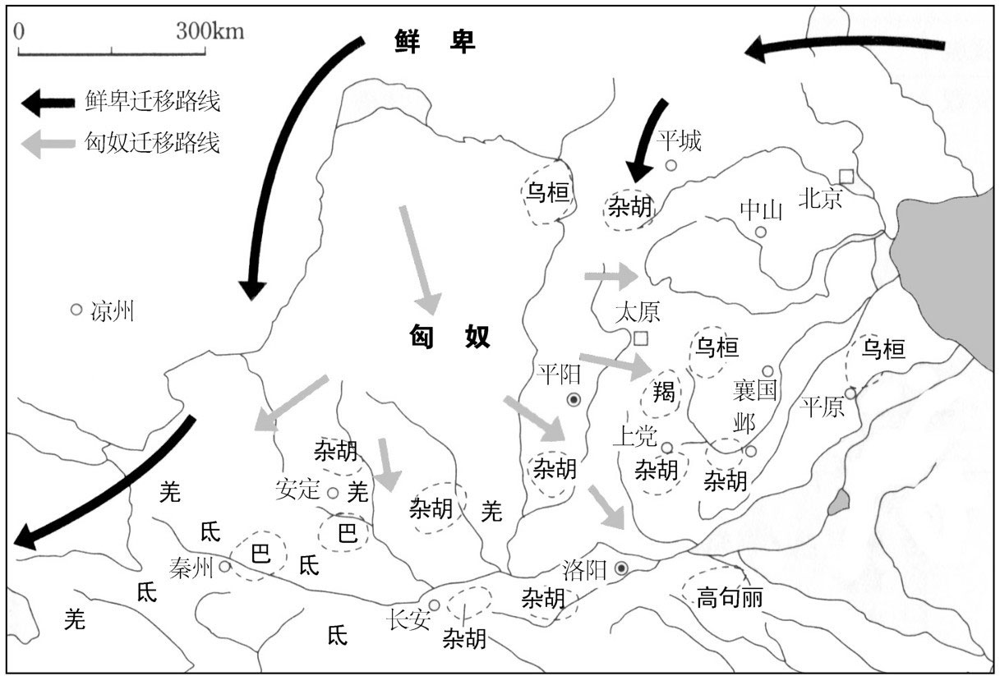

*20 西晋时期五胡的分布*

其中的先驱是匈奴。东汉初期内附于中原的匈奴，在曹魏时代居住在陕西北部至山西中部一带，西晋时期迁到山西汾水流域定居，也有不少人受汉人役使从事农耕生活。羯也被看做匈奴的一个分支，在山西居住，与匈奴的情况相似。鲜卑当时分为慕容、宇文、段、拓跋等各个部落，居住地分布在辽河上游到河北、山西北部。氐族、羌族从东汉末年以来，也来到陕西、甘肃地区定居。

西晋内部对这种情况感到担心。郭钦上疏建议将胡族迁到域外，江统则提出“徙戎论”敲响警钟，认为如此放任不理恐会出现可怕的事态。郭钦阐述道：“戎狄强犷，历古为患。魏初民少，西北诸郡，皆为戎居，内及京兆、魏郡、弘农，往往有之。今虽服从，若百年之后有风尘之警，胡骑自平阳、上党不三日而至孟津，北地、西河、太原、冯翊、安定、上郡尽为狄庭矣。”为使“裔不乱华”，应“渐徙平阳、弘农、魏郡、京兆、上党杂胡，峻四夷出入之防”。结果皇帝并没有采纳他的意见。

### 匈奴的政权

八王之乱就是在华北处于此种情势下爆发的。304年，刘渊即大单于之位，成为匈奴首领，以“汉”为国号。他分封郡县给同族人以及羯族出身的石勒等功臣，于309年定都平阳，大有南下之势。第二年，刘渊去世，其子刘聪继位，派遣石勒和同族的刘曜进攻洛阳，俘虏了西晋怀帝，然后又命令刘曜进攻长安，又将继怀帝之后被立为皇帝的愍帝俘虏，灭了西晋。318年刘聪去世，国内立即爆发内乱，刘曜和石勒镇压叛乱之后，刘曜定都长安，改国号为赵（前赵）。另一方面，石勒也加紧了自立的步伐，以襄国（今河北省邢台县）为都，建立后赵，与前赵呈对抗之势。

这个时期令人目不暇接的各个势力之间的斗争，从地区的观点来看，可以说是位于华北两大战略要地的两大势力——以长安为中心、据于关中地区的势力和以襄国、邺（今河北省临漳县）、中山（今河北省定县）等地为中心、据于关东的势力——之间的角逐。据于关中的前赵与据于关东的后赵之间的对立，之后发展演变为后赵与进入关东的前燕之间的对立，据于关东的前燕与据于关中的前秦之间的对立，据于关中的后秦与据于关东的后燕之间的对立，据于关中的后秦、夏与进入关东的北魏之间的对立。这种政治上的分裂，一直持续到鲜卑拓跋部所建立的北魏政权于439年统一华北为止。

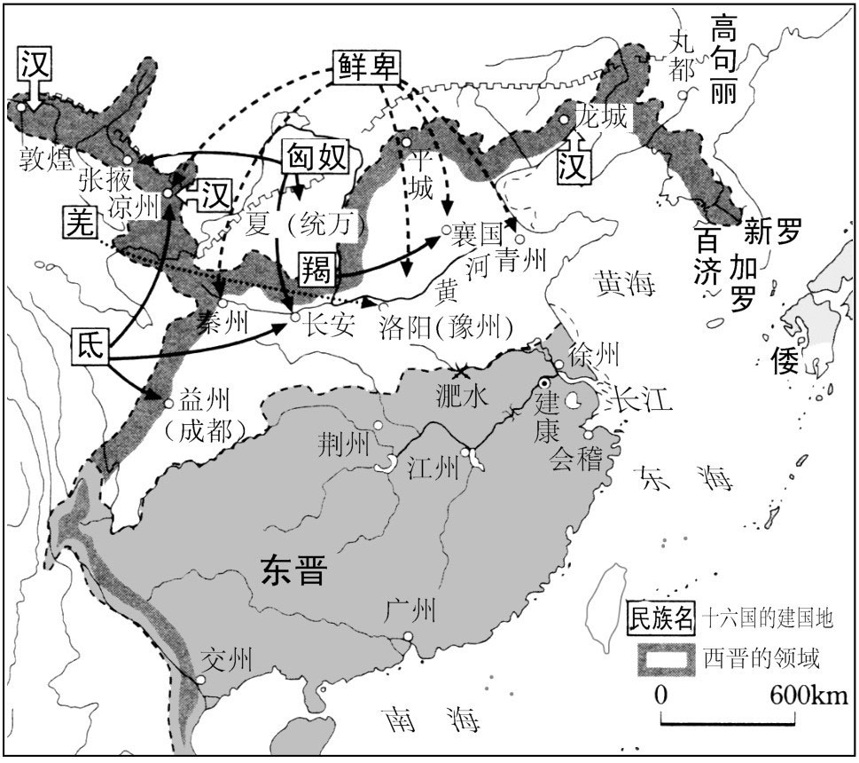

*21 五胡十六国时期地图*

另外，在南北朝后期北魏分裂以后，据于关中的西魏与据于关东的东魏之间互相对立，以及在此格局下发生朝代更迭后出现了北周和北齐之间的对立。当我们通观南北朝时期时，据于关中的势力与据于关东的势力使得华北一分为二的分裂格局，从四世纪初开始的五胡十六国时期一直持续到六世纪末北周灭掉北齐、统一华北为止，这可说是这一时期华北历史发展过程的一大特征。

关中和关东自秦汉以来作为华北地区的经济文化中心，成为各自政治势力的根据地，因此才产生了后来华北两个政权之间的东西对立，而石勒和刘曜的独立，可说是五胡十六国时期地区间对立最初的一个例子。

刘曜在长安修建宗庙和宫殿，让许多民众移居到这里，使长安得到充实，并且兴办太学和小学，致力于发展教育。这些政策表明他对中国文化有着相当的了解。据史书记载，刘曜好读书，常写文章，甚至还擅长书写草书和隶书。一提起胡人的君主，很容易让人联想起蛮横而对中国文化几乎一无所知、或缺乏理解的形象，事实上并非如此。匈奴的刘渊熟读儒教经典《春秋》《左传》等历史书，甚至还通晓《孙子》等诸子的著作。相传建立前赵政权的刘聪也是如此，他从小聪明过人，熟悉经典、史书和诸子的著作，善于书法，工于诗赋。到了后来前秦的苻坚、北魏的拓跋宏（孝文帝）在学识上也继承了这些胡人君主的传统。

### 羯族石勒的登场

统一关东之后，后赵的国力得到充实，于329年灭了前赵。建立后赵政权的石勒出生时是居住在山西省武乡这个地方的匈奴羌渠部的一支——羯族族长的儿子。二十岁时惨遭不幸，当时山西发生饥馑，他被别人掳走，卖到山东做奴隶。

据匈奴之刘渊传记载，刘渊在建立汉政权前夕，他的族人刘宣对他说：“晋人无道，将我们当做奴隶一样控制。”这是刘渊、刘宣等匈奴人将汉人对待他们的态度比作对待奴隶一样，而石勒则确实地落入奴隶的境地之中。他在被卖到山东的时候，还有许多头戴枷锁的胡人一路同行，从这里我们可以局部地了解到，当时胡人在中国内地的状况有多悲惨。

后来石勒发动了众多奴隶，变成盗贼团伙，成为首领，不断扩大其势力。此时刘渊反叛西晋，建立汉政权，中原则一片混乱。石勒审时度势，率领部下投奔刘渊，后得到刘渊的信任，被委以管理关东地区的重任。这为他后来飞黄腾达，登上皇帝宝座奠定了基础。

当时，汉致力于关中的经略，而石勒则采纳了谋士张宾的计谋，扎扎实实地培养自己的势力，以襄国为根据地，成功地在关东地区扩大其势力。而后在319年，当刘曜将都城迁到关中的长安，并将国号“汉”改为“赵”（前赵）时，石勒随即自立，将自己控制下的二十四郡作为赵国，即赵王兼大单于之位，史称“后赵”。石勒随后逐步西进，于329年灭掉前赵，第二年称帝。

石勒对汉族实施保护政策，严禁胡人凌辱汉人。另外，他还重视中原文化，严禁汉族厌恶的胡族风俗，如娶亡故父兄的妻妾为妻，以及服丧中结婚等。

当时，胡族与汉族相互之间的不信任处于最糟糕的状态，这种状况导致了胡汉之间的严重对立，杀戮和掠夺横行。在这种形势下，石勒推行这些政策的目的可说是为了缓和胡汉之间的对立。这与后来历史发展由胡汉对立向胡汉融和、融合的演变，存在着耐人寻味的关联。换言之，从后来的历史发展来看，当时石勒所采取的政策具有一定的预见性。关于胡汉的融和与融合，我们将在后面的章节中进行阐述。

### 佛教与后赵

石勒之所以采取融和政策，佛教在其中发挥了很大的影响。尤其是促使其皈依佛教的西域僧人佛图澄，起到了很关键的作用。

佛图澄是西域龟兹人。他在乌苌出家，在克什米尔学佛。当时，北印度、龟兹信奉的是小乘佛教，因此他传到中国来的想必也应该是小乘佛教。310年，佛图澄来到洛阳，痛心于石勒军队杀人如麻，便向石勒宣讲杀戮的不对，并谆谆诱导，最终成功使石勒信佛。

关于石勒皈依佛教的过程，流传着一些逸事。据说，有一天，石勒宠爱的儿子石斌突然死去，佛图澄竟然让石斌起死回生。为此石勒把所有孩子都送到佛寺养育，并在四月八日释迦牟尼佛圣诞日这天亲自到寺院灌佛发愿。

另外，根据佛图澄传的记载，他使用许多奇异的魔术手法，例如当众根据铃声预言未来的凶吉，让加满水的钵中开出莲花，将腹中的五脏六腑拉出、放在水中清洗后再放回腹中，等等，让以石勒为首的同时代的人们信服。

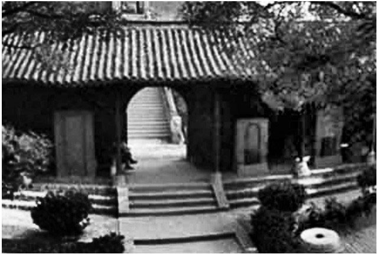

*22 邺城遗址 汉代，邺为魏郡的治所。三国魏的时期，邺城被列为五都之一，《魏都赋》吟咏了其繁华。石虎的豪奢生活详细记载在《邺中记》里*

由于这个时代战乱频仍，原有的价值观瓦解，越来越多的民众狂热地信仰从印度传入的、宣扬来世救赎的佛教。这时，佛图澄以及后来后秦时期因翻译法华经等经典而出名的鸠摩罗什等具有神异色彩和新知识的僧侣来到中国，对佛教的传播起了很大作用。石勒之所以保护佛教，固然与其自身信仰有关，但大概也是因为他充分认识到，在招揽人心方面宗教具有的强大力量。

然而，当时佛教也并非没有受到排斥。333年石勒去世，石虎废掉其继承人石弘，并于334年成为后赵的领导者。石虎当政期间，汉族出身的王度上奏曰：“佛，外国之神，非诸华所应祠奉。汉代初传其道，惟听西域人得立寺都邑，以奉其神，汉人皆不出家……今可断赵人悉不听诣寺烧香礼拜……其有犯者，与淫祀同罪。其赵人为沙门者，还服百姓。”朝廷的官员大多赞同这个意见。

不过，对于这一废佛的建议，石虎却下书曰：“朕出自边戎，忝君诸夏，至于飨祀，应从本俗。佛是戎神，所应兼奉，其夷赵百姓有乐事佛者，特听之。”

换言之，关于佛教的信仰，存在着佛是否属于外来之神的争论，其中潜伏着胡汉之间的对立。这个问题对我们思考此后五胡十六国、北朝各国对佛教的尊崇与王朝权力之间的关系，有很大的启发作用。

石虎即位后，便将都城迁至邺。他是有能力的武将，但征用了过多的百姓充当劳役，其统治极尽奢侈淫虐。因此人心离反，石虎一死，后赵便大乱，其部下、汉人冉闵建立了魏国（冉魏）。

### 鲜卑的崛起

此时，位于辽西的鲜卑族人慕容皝于337年定都龙城，称燕王，伺机准备南下。鲜卑的名字在历史上第一次出现是在西汉末，而据记述东汉历史的《后汉书》记载，鲜卑是战国时期在蒙古地区发展壮大的东胡的子孙后代。东胡被匈奴灭掉后（前206年），鲜卑便被匈奴统治，在西拉木伦河流域游牧。到了一世纪初，随着匈奴的衰落，鲜卑逐渐显露出独立的迹象。二世纪中叶，檀石槐成为首领（166年），统一鲜卑诸部，完全控制了蒙古全境，并积极向东汉发起进攻。到了三世纪初，以慕容、宇文、乞伏、拓跋等部为中心的鲜卑系部族，跋扈横行于内蒙古各地，同时由于晋朝的软弱无力，他们便向华北迁移。

在檀石槐的时候，慕容部便是鲜卑的一个组成部族，在右北平到上谷一带（今遵化到北京一带）游牧。到了三世纪初，从大凌河流域迁移到辽西，进行游牧的同时还从事农耕。

慕容皝是前燕（十六国之一）政权的建立者，他是鲜卑慕容部的首领慕容廆的儿子。

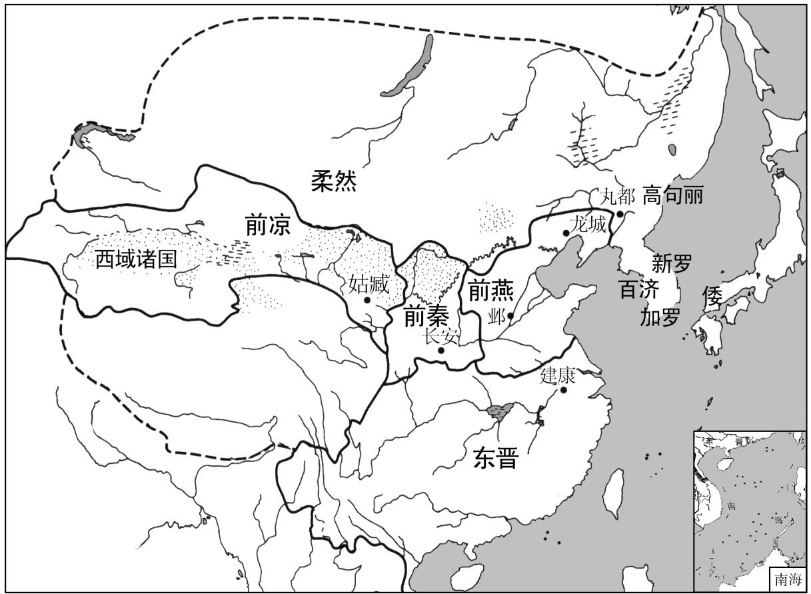

*23 东晋·十六国时期（四世纪）图*

在342年到346年间，慕容皝对辽东、辽西地区的对立势力发动进攻，攻陷了高句丽的国都丸都，灭掉了夙敌宇文部，并再接再厉，成功灭掉了扶余。在这个过程中，他于345年改用自己的年号，巩固了前燕作为东北亚强国的地位。

348年，慕容皝去世，其子慕容儁继位，进一步扩大了前燕的势力，趁后赵混乱之机出兵席卷河北。357年，将都城迁往邺（原后赵的国都），一跃成为中原的大国，成为此后诸燕国，即前燕之后的后燕、在山东建立政权的南燕、在河北建立政权的北燕等多个政权的滥觞。

此时，在华北另一中心即关中生活着吐蕃系的氐、羌两个民族。后赵发生混乱时，氐族酋帅苻洪和羌族酋帅姚弋仲争夺霸权，苻洪的儿子苻健取胜后，于351年在长安建立前秦政权。这时，华北地区迎来了氐族的前秦和鲜卑的前燕这两个大国东西对峙的时期。

不久，五胡十六国时期屈指可数的英主苻坚即前秦帝位，灭掉前燕后，强力推行由石勒试验过的胡汉融和政策。自此五胡十六国时期的历史，发生巨大的转变。

---

## 胡汉双方的情结

### 非我族类，其心必异

我们曾提到，八王之乱的中心人物之一、成都王司马颖（汉）被幽州刺史王浚（汉）所败，向匈奴的刘渊求救时，匈奴方面刘宣对此提出反对，认为“晋为无道，奴隶御我”，力谏刘渊不要理睬。另一方面，当时的汉族对刘渊则提出“非我族类，其心必异”，怀有强烈的敌忾之情。

就这样，在西晋、五胡十六国时期，胡族和汉族之间各自存在着自己（我）和他者（非我族类）的严格区别，各自怀有属于完全不同的集团的强烈意识，相互否定对方。

在整个五胡十六国时期，胡汉双方基于这种意识，不断进行着鲜血淋漓的抗争，而这个时期，在胡族和汉族之间，围绕着什么样的人才最适合成为中华世界的王者这个问题，意见上针锋相对，这种局面耐人寻味。

有一次西晋的忠臣、汉族人刘琨曾写信给羯族的石勒，请求派遣援军。他说道：“自古以来，诚无狄戎为帝王者，至于名臣建功业者，则有之矣。将军长于军略，必建勋功。”

看起来，汉族人刘琨的口气还真不小，明明是向石勒求救，还对胡族说你们反正是当不了帝王的。

永嘉之乱时群雄中有一位汉族人王浚，他后来觊觎皇帝之位，石勒便适时劝进，反倒招致王浚对其野心的怀疑。据史书记载，对此，石勒的使者借用之前汉族人刘琨写给石勒的话，说道：“且自古诚胡人而为名臣者实有之，帝王则未之有也。石将军非所以恶帝王而让明公也，顾取之不为天人所许耳。愿公勿疑。”（见《晋书·石勒载记》）王浚闻言，大悦。

石勒使者的口才之所以能发挥作用，是因为他想到这一逻辑肯定能够说服王浚。而事实表明，他的估计是正确的。

刘琨和王浚的事例说明，尽管当时汉族承认胡族的军事实力，并不得不依存于胡族的军事力量，但在汉族间却普遍存在一种歪曲的思想，认为胡族终归不能当帝王。考虑到当时的时代状况，与胡族相比，汉族在文化上处于优越的地位，而政治上、军事上却不得不屈服于胡族的压力，当汉族仍持有原来的夷狄观——夷狄禽兽不如，天生不过是汉族的奴仆——而又不得不应对现实的局面时，这种歪曲的思想便显露出来。

另一方面，与之相反的思想，也可见载于当时的史书中。匈奴的刘渊曾说道：“夫帝王岂有常哉？大禹出于西戎，文王生于东夷，顾惟德所授耳。”

鲜卑慕容部所建立的前燕政权的始祖慕容廆曾想招揽出身汉族名望世家的高瞻到自己胡族政权中为官，遭到拒绝，他不由感叹道：“奈何以华夷之异，有怀介然。且大禹出于西羌，文王生于东夷，但问志略如何耳。”

这里所表明的是与前面完全相反的思想，即胡族也能当帝王。刘渊、慕容廆虽然是胡族君主，却对“胡族终归不能当帝王”的汉族思想进行反驳，从他们的口中表现出超越这种思维的逻辑。

### 胡族的意识结构

然而，胡族一方的反驳却呈现出更为复杂的形态。前赵、后赵时期关中羌族的统帅姚弋仲有四十个儿女，他总是教诲这些子女说：“自古以来未有戎狄作天子者。我死，汝便归晋，当竭尽臣节，无为不义之事。”并最终在晚年时向东晋派遣使者，请求归属。

姚弋仲是五胡十六国之一后秦的创建人姚苌的父亲，他的思想与刘渊、慕容廆不同，沿袭的是前述汉族的立场。那么姚弋仲为什么会持有这种思想呢？当时的史书并没有明确说明其原因。由于姚弋仲上面的那段话是在后赵灭亡后不久说出的，可以推测大概这一政治形势的变化对他产生了直接的影响吧。

然而，从更宏观或更本质的立场来看，也可以认为这大致反映了姚弋仲对汉文化存在着某种情结或自卑心理。因为当时胡族文化的发展水平不如汉族文化、胡族在农耕化过程中表现出对自身文化的抛弃和自身文化的丧失以及与之相联动的，对汉文化的接受等，不管是有意为之，还是无意为之，都会产生这样的情结。

另一方面，前面说到西晋的忠臣刘琨向石勒求援，对此石勒在回信中说：“君当逞节本朝，吾自夷，难为效。”并厚待使者，赠予名马珍宝，其后断绝来往。

还有，前面也提到的王浚觊觎帝位时，石勒在呈送给王浚的上表文中，自称“勒本小胡，出于戎裔”。

在这里石勒对汉族的刘琨和王浚自称“夷”、“小胡”、“戎裔”等，显得十分自卑。表面上看石勒似乎与姚弋仲有着相同的思想，但石勒以“夷”自居的结果，是跟刘琨断交，虽然石勒在王浚面前表现得非常谦卑，实际上却想着吞并对方。从这里我们可以看出，他的想法与姚弋仲差得很远。

也就是说，他虽然自称“夷”、“小胡”，内心却是对汉族的强烈不满，有着走向独立的意志。

### 胡汉相互之间的他者认识

石勒的思想与姚弋仲的大不相同。那么，在当时的胡族中，具有姚弋仲那样思想的人，以及接近于石勒思维的人，是否是各自单独存在的？乍一看好像是这样的。

然而，当我们再往他们的内心深处迈进一步，并注意到当时胡族进入汉族地域并成为其统治者的这种时代背景时，对这个问题就不能如此简单地下结论了。

由于这种心理因素很难作为史料留存下来，我们就很难具体地探求当时胡族的心态，如果硬要对此进行想象，我们自然就会想到，在胡族的内心或说在他们自己也未能充分意识到的思想深处，他们对汉族和汉文化的情结与他们对于独立的志向之间，存在着复杂的联系。

另外，前面我们也提到，鲜卑出身、奠定了五胡十六国之一的前燕政权基础的慕容廆，以胡族君主的权威作背景，要华北的汉族名望人士高瞻出仕，为自己的政权服务。胡族政权吸收这类汉族士大夫进入自己的官僚机构，是看中了他们身上所具有的行政能力，或作为豪族在地方社会的影响力等，这是胡族经营汉地的必要条件。因此慕容廆才会力邀高瞻出仕，却被胸怀夷狄观的高瞻拒绝了。

虽然高瞻的这种态度引起慕容廆的强烈不满，并有了前述的一番感叹，然而最终慕容廆并没有因此而处置他。

不过，据当时的史书记载，高瞻害怕受到处置，烦闷不堪，最终竟然担惊受怕而死。高瞻致死的事件是一个合适的案例，向今天的我们真实地传达了当时胡族错综复杂的心态，以及汉族对此的心态。

虽然个案不尽相同，但从整体来看，可以认为在当时的汉族人心里，存在着在文化上对胡族具有优越感的夷狄观，以及在政治上、军事上被胡族压抑的屈辱感和恐惧感。而在胡族心里，或多或少地在军事上对汉族的优越感、对汉族和汉文化的情结或否定的心态等混杂在一起，既有歪曲的成分，也有摇摆不定的成分，特别是当时的胡族统治者，注定要将“优越性”摆在最前面。

---

## 汉族和胡族所产生的变化

### 华北士大夫与江南政权

上一节我们论述了永嘉之乱以后，失去了正统王朝西晋作为依靠的华北汉族士大夫对席卷华北地区的非汉族王朝所持有的种种态度。在上一节中，没有探讨这一时期华北汉族对江南汉族王朝的心态，以下就这点展开论述。

既然汉族对胡族有所忌避，那么我们就很容易误以为他们会心系同样由汉族在江南建立的东晋新政权。然而，实际上这个时期的汉族并非异口同声地认同东晋为继承西晋的正统王朝。另一方面，正如前面提到的羌族酋帅姚弋仲那样，胡族也并非人人都忌避汉族的东晋政权，也有胡族承认汉族政权、希望归属汉族政权。在这些情形背后，都隐藏着什么样的思想意识呢？

五胡十六国中有一个由汉族建立的王朝——前凉。在晋末战乱的时候，前凉政权的始祖张轨看到家乡安定（今甘肃省平凉）以西延绵的河西绿洲地带，农牧物产丰富，又兼有与西域交易的便利条件，同时还不会受到中原地区战乱的影响，于是要求前往担任地方官，随后成了半独立的状态。这是前凉的前史。

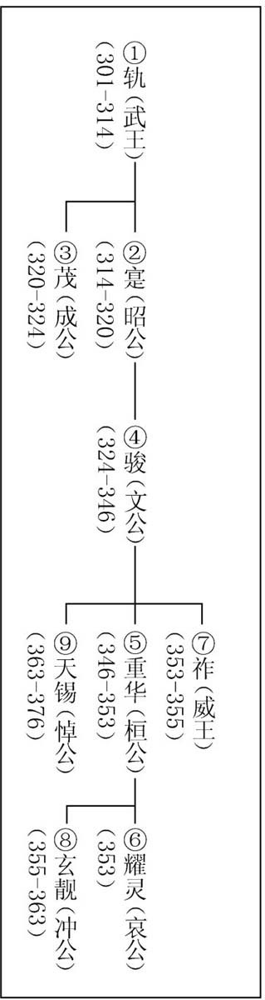

*24 前凉系图*

西晋灭亡后，西晋皇族、琅邪王司马睿在江南建立东晋政权，改年号为太兴。这时前凉的领导者为张轨之子张寔，一直延续使用西晋愍帝的年号建兴，仍称建兴六年。后来，前凉也曾使用自己的年号（如年号和平），不久又恢复为建兴。此后在前凉使用建兴年号期间，李俨在前凉的领域内试图自立，尊奉东晋的年号，被前凉领导者张玄靓率众讨伐。

史书中有对这个时期局势的记载，说前凉民众听到李俨准备尊奉东晋的年号都非常高兴。这些记载表明，尽管西晋已灭亡将近四十年，前凉仍存在着尊奉西晋和尊奉东晋的两派势力之间的纷争。

换言之，在西晋向东晋过渡的过程中，在汉族内部产生了对于东晋政权的正统性的怀疑。然而我们可以指出，尽管如此，胡族政权下的华北汉族士大夫大多心系晋家皇族司马睿在江南建立的东晋政权，这也是实情。

### 宋的正统性

到了东晋之后的下一个江南汉族王朝——宋的时期，这种状况似乎又出现了变化。在东晋灭亡、东晋将军汉族人刘裕建立宋的前夕，东晋皇族司马国璠、司马叔道逃亡到五胡之一的羌族在长安所建立的后秦。

当时后秦皇帝姚兴问他们：“刘裕匡复晋室，卿等何故来也？”国璠等人回答说：“裕与不逞之徒削弱王室，宗门能自修立者莫不害之。”由此，姚兴看到此时在长江中游和上游的四川的东晋将士中，有许多反对宋的力量，于是意欲联合他们对宋发起战争。

另外，这时在丝绸之路沿线、河西地区的酒泉，存在着五胡十六国的一个政权——西凉。西凉政权的王室自称是西汉将军李广的子孙，世代担任敦煌太守。最近，在甘肃省酒泉市区以西八公里的地方，发掘出据判断是魏晋时期最大的一处古墓，墓主被认定为西凉王朝的始祖李暠。而在晋宋更迭之时的西凉王李歆正是李暠的儿子。李歆在位四年，正值江南政权更替，此时李歆也计划率军讨伐刘宋。

司马国璠等人对刘裕的反抗，属于从江南出逃的人士、长江中游地区的将士的反抗，而李歆的反对则是河西地区汉族君主的反对，并不代表华北士大夫对刘裕的反对。然而，既然当时华北士大夫倾心归附于东晋政权，那么可以认为，我们前面所看到的逃亡人士对宋的创建者刘裕的抗拒，同样也存在于华北士大夫身上。

更何况刘裕出身贫寒，并非像司马氏那样的贵族。考虑到这个时代人们具有强烈的身份意识，正如贵族的存在所明确展现的那样，华北士大夫对刘宋政权的强烈抗拒，并不仅仅是因为刘裕灭掉了东晋而篡夺了政权，他的出身问题也是一个重要因素。

*25 河西走廊 从长安到堪称丝绸之路大门的敦煌，所经过的路线叫河西走廊。照片为武威地区的景观*

五胡十六国时期，由于厌恶战乱和胡人的统治，许多人从华北移居到江南。而应该注意的是，这种现象也只是出现在东晋时期。自刘宋篡位以后，几乎再难看到有华北士大夫逃亡江南，这与此前的情况截然不同。这与江南士大夫对刘宋政权的抵触，也有一定的关系。

换言之，刘裕建立的宋王朝，是一个正统性备受华北汉族士大夫质疑的政权，同时引起了他们“对江南政权的离心”。刘宋建国时华北士大夫出现了一种趋势，他们对待胡族政权不再像本章前面所论述的那样采取忌避的态度，而是在华北统一的背景下，承认终于逐渐进入安定期的胡族政权为中原王朝，并给予支持。详情将在后面的章节展开。

五世纪上半叶鲜卑拓跋部使华北再度统一，建立了北魏政权。在记载北魏历史的《魏书》中，为建立东晋政权的司马睿立传时，称其为“僭晋”即“僭越而称晋的司马睿”，而在为后来刘裕及其以后的江南诸朝皇帝立传时，都一律称之为“岛夷某人”，例如“岛夷刘裕”。华北汉族士大夫思想发生了很大变化，甚至连这种记载上的变化都受到影响（把江南政权视为夷狄）。

### 汉族士大夫追求的道路

反过来想想，在这个时期置身于异民族的统治之下或不断遭受异民族侵扰进攻的华北士大夫，他们可以选择的道路包括接受异民族的统治在其王朝中出仕为官、虽然置身于异民族的统治却拒不出仕以显示身为汉族的矜持、尊奉江南王朝为盟主反抗异民族，等等。应该引起我们关注的是，当时的华北士大夫尽管身不由己，但只要条件允许，他们当中有实力的人士就会力图形成一股独立的势力。

为西晋而在边境之地独守孤垒的前凉张重华（张轨的曾孙），曾在348年接待了东晋派来的使者，对方许诺封给他大将军的官位和侯爵的爵位。当时鲜卑的慕容皝所自称的燕国王爵已得到东晋王朝的承认。“为什么我们世代为晋尽忠守节，却只能封个侯爵，处在并非忠臣的鲜卑的下风？”因此张重华感到很生气，拒绝受领东晋使者带来的诏书。

到了张祚这一代，终于称帝，设置百官，不再尊奉西晋建兴的年号（当时为建兴四十二年），而改用自己的年号，为和平元年。

然而，在前凉阵营中，依然存在反对这次革命的势力。从建兴改元为和平的这一年二月，灾异频发。于是郎中劝谏他说：进行革命之事，臣窃以为不可。华夷之所以归系大凉，义兵之所以千里响应而至，是因为陛下是守晋的忠臣。现在自称承受天命，即位称帝，天下人看到这种行为，恐怕就不会再相信陛下了。前面我们提到李俨自立，尊奉东晋的年号，反对张祚，正是发生在这次革命事件之际。

换言之，当时前凉阵营中，同时存在着几种倾向，很难形成统一的舆论，既有尊奉西晋的（使用西晋年号，称建兴四十三年），也有尊奉东晋的（以中兴为年号），还有希望独立的（进行革命）。

前凉的张天赐执掌了朝政之后，在建兴四十九年改元升平（东晋年号）。这是受东晋大将桓温北伐、其军威声震华北的影响，而此后前凉一直尊奉东晋的年号咸安，直至灭亡。（桓温北伐详情将在本书第四章展开）

至此，我们主要以五胡十六国之一前凉的政局变化为例进行了论述，审视了这一时期汉族士大夫的态度，从其演变轨迹中我们可以真实地看到他们力图保持中华的传统以及为寻求和追随所奉正朔的对象而痛苦跋涉的身影。

这里向大家介绍在这个动荡不安的年代中一位士大夫的故事。在永嘉之乱时，河北范阳出身的李产作为乡里的领导者努力保全民众，后来在石勒的后赵政权中出仕，任范阳太守。遭到前燕攻击后又开城投降。在李产的传中，有如下记载：

及慕容儁南征，前锋达郡界，乡人皆劝产降，产曰：“夫受人之禄，当同其安危，今若舍此节以图存，义士将谓我何！”众溃，始诣军请降。儁嘲之曰：“卿受石氏宠任，衣锦本乡，何故不能立功于时，而反委质乎！烈士处身于世，固当如是邪？”产泣曰：“诚知天命有归，非微臣所抗。然犬马为主，岂忘自效，但以孤穷势蹙，致力无术，僶俛归死，实非诚款。”儁嘉其慷慨，顾谓左右曰：“此真长者也。”（《晋书》载记第十）

这段引文稍微有点长，但这则故事向我们生动地传达了这个时代士大夫的苦衷。他们心里期盼着汉族正统王朝解放华北，却眼看着随着胡族势力的扩张这种可能性越来越小，于是不由地发出天命为何的叹息。可以说这是生活在五胡十六国时期的汉族士大夫共有的心情。

### 胡族与正统王朝

上面我们探讨了五胡十六国时期华北汉族的思想。那么，作为这个时期另一方的主角，当胡族入侵中原的世界或与中原的世界对峙时，他们有什么考虑？他们想要创造一个什么样的世界？

首先需要明确的是，胡族对自己所灭掉的西晋王朝，并没有继续尊奉的意思，尽管这是不言自明的事情。不过，胡族承认西晋是在他们自己建立的前赵、后赵等政权之前统治中原世界的正统王朝。西晋作为对于胡族而言的异民族——汉族所建立的王朝，其正统性并没有被否认。西晋是统一中国、包摄华夷的王朝，胡族自身过去也曾作为臣下参与筹划——这种意识存在于胡族之中。正如前面我们看到的，羌族酋帅姚弋仲告诫子女说：“古以来未有戎狄作天子者。我死，汝便归晋，当竭尽臣节……”这说明姚弋仲具有以汉族王朝东晋的臣子自居的意识。

当时，四川有一个由蛮族賨人所建立的五胡十六国之一的成汉政权。其第三代君主李雄曾发表过支持东晋元帝的言论：“我乃祖乃父亦是晋臣，往与六郡避难此地，为同盟所推，遂有今日。琅邪（即东晋元帝司马睿）若能中兴大晋于中夏，亦当率众辅之。”另外，据史料记载，在氐族所建立的前秦政权的朝议上，有人指出：“且晋中宗，藩王耳，夷夏之情，咸共推之，遗爱犹在于人。”从这两个例子可以看出，在东晋建国时，存在这样一种认识，即元帝得到“夷夏之情”即汉族和夷狄的支持。换言之，在东晋建国时，正如大多数汉族所认同的那样，尽管对于非汉族而言东晋政权难说稳如磐石，却具有正统王朝的资格。

只是不应忘记，在这种情况下非汉族对东晋的承认，并不是认识到东晋是继承西晋正统的王朝，而是他们认为吸纳自己所占领的华北地区占据人口多数的汉族的意向，有助于加强其统治，即非汉族的立场与汉族不同，他们是从更现实的观点出发，意识到当前支持东晋是上策。

关于这一点我们可以举出一个很好的例子。鲜卑慕容部在慕容廆的时代，曾劝东晋元帝继承晋的正统而即帝位，到了其孙慕容儁的时代，慕容儁自己被群臣劝进即帝位，他先是谢绝说：“吾本幽漠射猎之乡，被发左衽之俗，历数之箓宁有分邪？”不久却即位，并对东晋使者说：“汝还白汝天子，我承人之乏，为中国所推，已为帝矣。”

然而，承认东晋的这种意识，是否完全是胡族基于现实的利益判断而得出的结果？却也不尽然。这是因为，当时的胡族中存在着认为自己或本民族不如汉族的意识，并因此认为本民族所创立的政权缺乏正统性，反而把江南的东晋政权推为正统王朝。例如，氐族所建立的前秦政权中的其中一位皇族苻融即认为中华的正统性在于东晋。

而与这种意识大相径庭的意识当时亦在孕育之中。后来在胡族当中出现了认为自己是正统、江南的汉族王朝为夷狄、而我们才代表中华的思想，不过，这种思想要成为主流，仍然需要经过数番曲折的过程。

---

# 第三章 跨越胡汉之壁垒

## 苻坚的时代

### 冉魏的兴亡

我们在上一章审视了结束从东汉末年到三国时期混乱局面、成功使中国再度恢复统一的西晋，经历了短暂的和平之后又分崩离析，陷入比以前的社会动荡更为激烈、波及范围更广的五胡十六国时期的混乱局势。同时我们也详细地论述了造成这一混乱的其中一大原因，即这个时期各民族相互之间错综复杂的憎恶情绪。

这种憎恶最集中地体现在冉闵之乱前后所发生的各民族之间的大虐杀中。冉闵出身汉族武将家庭，其父是后赵（由羯族所建立的五胡十六国之一）皇帝石虎的养子，因此他使用羯族的姓，称自己为石闵。冉闵智勇双全，深受石虎的喜爱，在后赵的诸将中有重要的地位。石虎去世后，他帮助石遵登上帝位。然而，石遵违背诺言，没有立他为太子，于是冉闵便杀掉石遵而改立石鉴。不料这次由于石鉴又要杀他，冉闵便认定羯族的人不足为信，将后赵王族几十人统统杀掉，自己即位当上了皇帝。

冉闵以大魏为国号，都城与后赵一样设在邺，于是五胡十六国时期少见的汉族政权诞生了。据说冉闵利用汉族对胡族的反感，对胡族施行大虐杀，将多达二十万的胡族尸首遗弃城外，任由狼群啃食。在这次对胡族的大虐杀中，但凡高鼻梁、蓄胡子的具有胡族相貌的人不分胡汉一概被杀，其影响波及四方，乃至演化成数百万的胡族在各地互相残杀的局面。因此中原地区的人们无法从事农耕，盗贼横行，大饥荒爆发。

随后冉闵的军队被羌族姚襄的军队大败，战死的士兵多达十万。冉闵政权内部陷入混乱，招致鲜卑慕容部建立的政权前燕乘虚南进。352年，冉闵兵败，被前燕军活捉后被杀。

冉闵之乱是由于民族之间的憎恶而引发的一场真正的悲惨灾难，然而通观五胡十六国时期，历史在此到达了拐点，从混乱、崩溃渐渐向收敛、统一的方向转变。此后，各族之间的憎恶渐趋缓和，历史朝着胡汉融合的方向发展。

最初上场的主角是鲜卑慕容部所建立的前燕政权，以及氐族所建立的前秦政权。随后不久又经鲜卑拓跋部建立的北魏政权的继承，永嘉之乱以来政局混乱几乎持续一个半世纪之久的华北地区，在北魏第三代皇帝太武帝时期（439）再次实现统一。

本章我们将论述从跌入混乱谷底的时期向华北再度统一的方向发展的这段历史过程。

### 苻坚的登场

五胡之一的氐族当时是生活在现中国陕西省和甘肃省的一个民族，他们以长安以西的武都、略阳为根据地，以杨氏、苻氏、吕氏等豪族为中心，势力不断增强，建立了前秦、后凉等政权。其中前秦是氐族的族长苻健在后赵石遵的时期从其麾下脱离出来独立后、领导其父苻洪的部下于351年建立的政权。

前秦定都长安，逐渐发展为一股强大的势力，与后赵瓦解后鲜卑慕容部在华北建立的前燕东西二分。苻坚是苻健之弟苻雄的儿子，生于338年，由于在苻健之后继承帝位的苻健之子苻生多行残虐之事，苻坚将其铲除，自己即帝位。

苻坚即位之后，立即着手治理内政，订立法制，抑制工商，奖励农耕，并兴修连接首都长安和地方的道路，对学问实施保护和奖励的措施。国力得以充实，文化获得发展。相传苻坚年幼时向祖父苻洪提出希望跟从老师读书的请求，祖父听后又惊又喜，说道：“汝戎狄异类，世知饮酒，今乃求学邪！”便准许他跟随老师学习。

这里所说的学问当然是汉族的学问，这段逸事本身不免让人觉得其中反映了基于汉族的歧视意识。在苻坚的时代，他推行了诸如提拔汉族士大夫、保护学问等与此前胡汉严重对立的华北地区大为不同的融和政策。

另外与此同时，对外苻坚于370年讨灭了雄踞华北一方的鲜卑慕容部创建的前燕，376年灭掉了前凉，进一步吞并了在北方不断扩大势力的鲜卑拓跋部，一时成功地统一了华北地区。

### 苻坚的政策

苻坚有汉学的修养，从即帝位时起便采用了汉族传统的治政方针施政，在此过程中，协助其施政的汉族士大夫王猛发挥了重大的作用。这种胡族君主与汉族谋士相配合的形式，前有羯族的石勒与汉族的张宾，后有北魏时期的太武帝与崔浩，而苻坚与王猛之间的亲密程度，可说是前述二者所不可比拟的。

有一次，氐族人、功臣樊世当着众人责备王猛说：“吾辈与先帝共兴事业，而不预时权；君无汗马之劳，何敢专管大任？是为我耕稼而君食之乎！”这些言语表达了统治汉族地区的胡族将汉族当成为胡族耕作的奴隶，以及对不得不接受汉族出身的王猛差遣的不满。而王猛当即反唇相讥：“方当使君为宰夫，安直耕稼而已。”考虑到当时胡汉的势力关系，王猛这么说可是非同小可的。果然，樊世大怒，“要当悬汝头于长安城门，不尔者，终不处于世也”。王猛将这件事向苻坚报告。

备受君主宠信的宠臣与王朝的功臣之间出现这样的冲突，这在历朝历代都是常有的事，而耐人寻味的是，苻坚听到王猛的报告之后，说道：“必须杀此老氐，然后百僚可整”，将樊世斩首，为此还引发了氐族的骚动。因为在胡族作为统治者君临中原的五胡十六国时期，相反的事件即汉族被胡族肃清本是惯例。

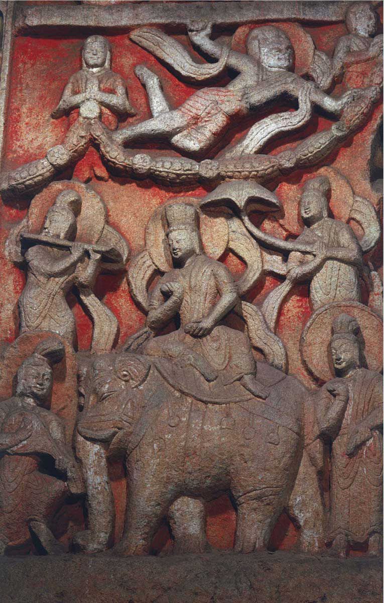

*图二 云冈石窟第六窟后室中心塔柱下层北龛佛传故事北魏——山西大同市郊的云冈石窟，现存主要洞窟45个，造像五万余躯，是北魏时期皇室经营的第一座大型石窟，是中国北方地区早期石窟的典型代表。此通高110厘米，为太子乘象故事。*

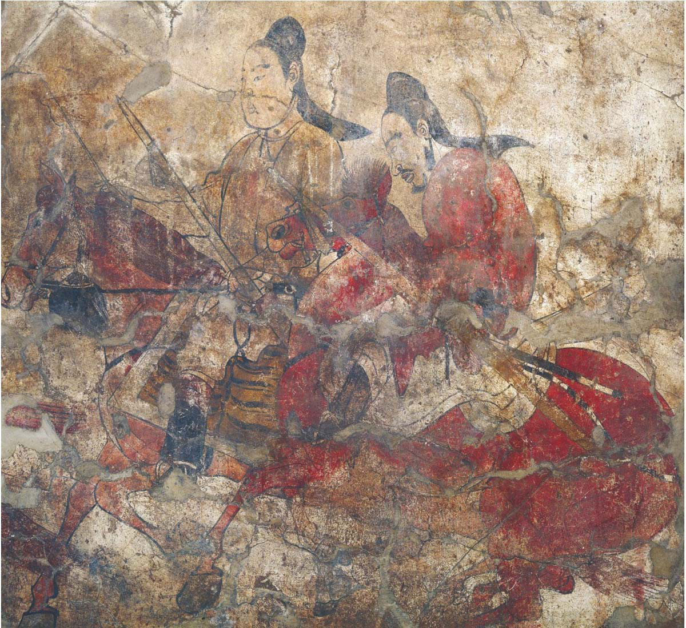

*图三 娄睿墓鞍马出行图壁画北齐——出土于山西省太原市娄睿墓。娄睿为北齐武明皇太后的内侄，官至大司马。壁画位于墓道西壁中栏，以长卷式展开。画面构图新颖，层次分明，人物生动，堪称中国美术史上的杰作。*

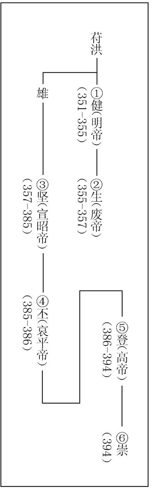

*26 前秦（苻氏）系图*

从“将汉族当成为胡族耕作的奴隶”这种思维中，我们很容易了解到汉人在胡族统治下的处境，而樊世的遭遇截然不同，这也可以看出苻坚对王猛非常信任。

只是，如果君主与宠臣之间的关系很密切，即便这个时期存在胡汉的对立问题，君主对宠臣的维护也不见得有多么奇怪。但是，苻坚却常常做出超过这种程度的反应。

苻坚的这种特点也局部地体现在前秦与夙敌鲜卑族所建立的前燕为了争夺中原霸权而进行决战时。当时，前燕王族、后来后燕的创立者慕容垂逃亡到前秦，王猛向苻坚进言道：“慕容垂……人之杰也。蛟龙猛兽，非可驯之物，不如除之。”然而，苻坚却说道：“吾方以义致英豪，建不世之功”，接受了慕容垂的投诚。在攻下前燕之后，他的这种力图跨越民族间壁垒的姿态以更为彻底的方式展现出来。

苻坚即位以来，陆续采纳和实施了中国传统的国家礼仪，建造了明堂（中国古代用于举行祭祀大典的场所），在国都的南边举行祀天仪式（汉族王朝最重要的祭典），躬耕籍田（皇帝所进行的农耕礼节），后来还命人举行了养蚕之礼，等等。

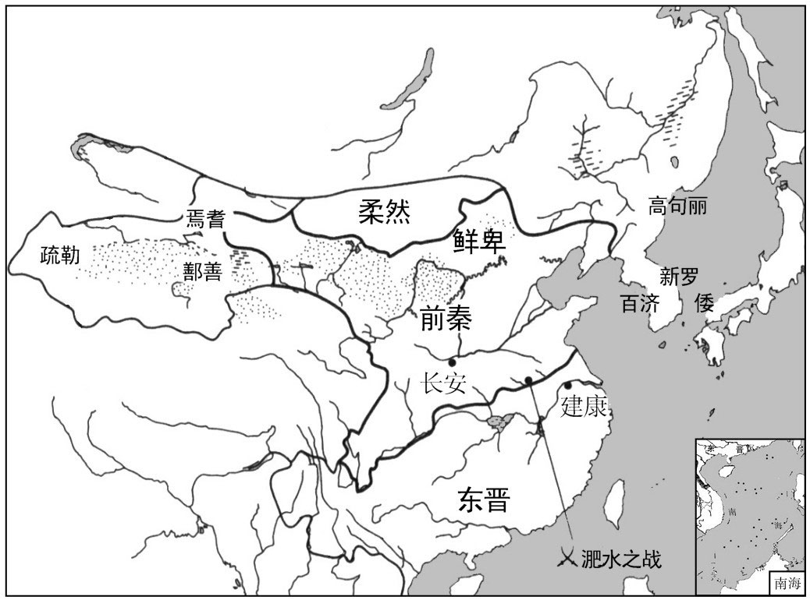

*27 前秦全盛期图*

平定前燕、成为中原霸主之后，苻坚随即更为热心地借助儒教理念推进国家建设，健全风俗，恢复了魏晋时代士族阶层人士的户籍，努力为前秦王朝收揽士族阶层的人心。

另外，苻坚将氐族本族人从中央迁移到前秦新占领的统治地区，而反过来将前秦征服的鲜卑、羌、羯等五胡各族迁移到国都周边，并加以宠任。佛教僧人道安被群臣评为“毁形贱士”，皇帝身边的人进言欲将其除去，而苻坚却对他信任有加，并虔诚地尊奉佛教。

### 民族融合政策之功过

贯彻这样的政策，可以说自然而然地弱化了从根本上支持前秦政权的氐族集团的纽带，存在着导致王朝解体的危险。正因为如此，氐族重臣屡次向苻坚进言，强调这种政策的危险性。

据史载，苻坚最小的弟弟苻融曾哭着进谏道：“陛下宠育鲜卑、羌、羯，布诸畿甸，旧人族类，斥徙遐方……鲜卑、羌、羯……此皆国之贼也，我之仇也。”然而苻坚却没有听从他的谏言。就连苻坚的谋士、汉族出身的王猛也对苻坚进言说，鲜卑、羌等是国家的仇人，是国家的祸根，应该把他们除掉。

群臣与苻坚之间想法不一致最为尖锐的表现，是在苻坚准备南伐时的朝议上。在统一华北之后，苻坚计划讨伐据于江南的东晋，后来引发了与东晋之间的淝水之战。这次南伐的计划遭到了群臣的一致反对。

当时群臣列举了种种反对的理由，包括东晋国内安定，汇聚了谢安等一批贤臣；东晋据有长江之险，易守难攻；中原刚刚平定不久，将士疲惫不堪；鲜卑、羌等异族受到优待，而氐族反而受到轻视，在目前这种情况下，劳师远征对国家而言是非常危险的举动，等等。就连苻坚所信任的王猛在生前也指出，东晋虽然偏安于江南，但政局稳定，具有中国王朝的正统性，因此不能对其发动攻击。

对于群臣发表的上述意见，苻坚说道：“任由东晋如此发展下去，非社稷（国家）之利，我希望统一天下，拯救民众。”他不再允许群臣发表反对意见，在统一不久的各族混编部队的基础上组建了一支多达百万人的军队，挥师南征。

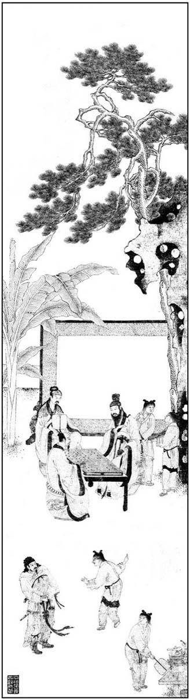

*28 明代尤求《围棋报捷图》从侧面描绘了东晋淝水之战捷报传送谢安的故事*

结果以前秦大败告终，各族趁机发起叛乱。前秦这个由各民族各个势力组成的马赛克般的政权，瞬间瓦解。苻坚自己也在混乱之中，被羌族的姚苌所杀。那么，为什么苻坚会推行这些加快王朝灭亡的政策呢？在他所推行的政策中，特别引人注意的是，他轻视本民族氐族，而优待甚至宠任汉族和鲜卑族。为了成就华北统一大业，结束长期的各民族对立的局面，当然是需要采用这些政策的。

但是问题在于，这种政策在当时的情况下具有多大的现实性？事实上，苻坚的这种民族政策弱化了与前秦统治的核心——氐族之间的联系，淝水之战后，华北再度回归到各族割据混乱的局面。

那么，我们能否把苻坚的政策看成只是理想主义的产物呢？当我们看到从五胡十六国到南北朝时期这段战乱频仍的历史，便不能把苻坚的政策简单地归结为理想主义的产物。人民追求和平与统一的心愿确实极为强烈。另外，在这些政策中，苻坚旨在确立王权的冷静而现实的判断也起到了推动作用。这典型地表现在他在重用王猛时却将氐族功臣斥为“老氐”的态度上。

五胡各王朝的政权显然并非是一君万民性质的体系所构成的，而是由王族、部族长所统率的各个集团的联合体组成。前秦是以具有这种结构的氐族集团为核心、以具有同样结构的匈奴、鲜卑的集团为外延，并包含各豪族所领导的汉族集团在内的国家联合体。虽然王权力图加强其权力，却存在着许多阻碍其扩充羽翼的因素。

尽管如此，倘若在这种情况下不得不与其他政权展开难以避免的殊死搏斗并从抗争中胜出的话，那么对于在位者而言，就一定要强化专制君主性质的王权。

这个时候，从新征服的土地上获得人才、税收等资源，便在加强王权的过程中发挥着巨大的作用。因为这些资源对皇帝、王族或各部族长的力量关系起着决定性的影响。

换言之，苻坚希望通过对其他胡族政权的征服，获得胡族的军事力量，通过对汉族的统治，获得人才和庞大的资源，并对此加以利用以达到确立和加强王权的目的。

---
